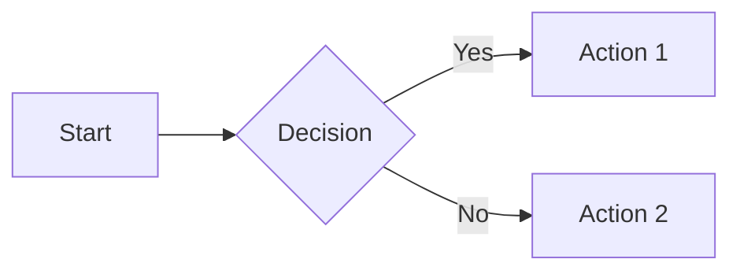

# 使用指南

DocsForge 是 MkDocs + Material 的替代方案。本指南涵盖日常使用，从创建新站点到部署站点。

## 快速开始

### 创建新站点
```bash
# 安装 DocsForge
pip install docsforge

# 交互式创建新项目
docsforge
cd my-docs

# 构建并本地预览
docsforge serve
```

### 构建已有站点
```bash
cd your-project
# 编辑 docsforge.yml，然后：
docsforge build
# 输出到 site/
```

## 命令

| 命令 | 说明 | 示例 |
|---------|-------------|---------|
| `docsforge` | 交互式创建新项目 | `docsforge` |
| `docsforge build` | 构建站点 | `docsforge build` |
| `docsforge serve` | 构建并在本地提供实时重新加载服务 | `docsforge serve` |
| `docsforge --version` | 显示版本 | `docsforge --version` |
| `docsforge --help` | 显示帮助 | `docsforge --help` |

## 配置（`docsforge.yml`）

### 基本配置
```yaml
site_name: My Documentation
site_url: https://example.com/docs
site_description: A great docs site
site_author: Your Name

copyright: Copyright © 2025

nav:
  - Home: index.md
  - Getting Started: getting-started.md
  - Reference: reference.md

docs_dir: docs
site_dir: site
```

### 主题定制
```yaml
theme:
  name: material
  logo: assets/logo.png
  favicon: assets/favicon.png
  
  palette:
    - media: "(prefers-color-scheme: light)"
      scheme: default
      primary: indigo
      accent: indigo
      toggle:
        icon: material/brightness-7
        name: Switch to dark mode
    - media: "(prefers-color-scheme: dark)"
      scheme: slate
      primary: indigo
      accent: indigo
      toggle:
        icon: material/brightness-4
        name: Switch to light mode
  
  features:
    - navigation.tabs
    - navigation.sections
    - navigation.expand
    - navigation.path
    - navigation.top
    - search.suggest
    - search.highlight
    - content.code.copy
    - content.code.annotate
    - content.action.edit
```

### 语言与搜索
```yaml
theme:
  language: en
  
  # 多语言搜索流水线
  search:
    language: en
    pipeline:
      - stemmer
      - stopWordFilter
      - trimmer
```

### Markdown 扩展
```yaml
markdown_extensions:
  - admonition
  - pymdownx.details
  - pymdownx.superfences:
      custom_fences:
        - name: mermaid
          class: mermaid
          format: !!python/name:pymdownx.superfences.fence_code_format
  - pymdownx.tabbed:
      alternate_style: true
  - pymdownx.tasklist:
      custom_checkbox: true
  - pymdownx.emoji:
      emoji_index: !!python/name:docsforge.emoji.twemoji
      emoji_generator: !!python/name:docsforge.emoji.to_svg
  - tables
  - toc:
      permalink: true
```

### 插件
内置插件会自动加载。只有当你想自定义插件时才需要声明：

```yaml
plugins:
  - search:
      lang: en
  - tags:
      tags_file: tags.md
  - blog:
      blog_dir: blog
      blog_toc: true
```

## 内容特性

### 提示框（标注）
```markdown
!!! note
    This is a note.

!!! warning "Be careful"
    This is a warning with a custom title.

!!! tip
    This is a tip.
    
    It can have multiple paragraphs.

!!! danger
    Don't do this!
```

### 代码块
```markdown
```python
print("hello")
```

```yaml
key: value
```
```

带有注释：
```markdown
```python
print("hello")  # (1)!
```

1.  :man_raising_hand: This is an annotation!
```

### 内容标签页
```markdown
=== "Python"

    ```python
    print("hello")
    ```

=== "JavaScript"

    ```javascript
    console.log("hello");
    ```
```

### 任务列表
```markdown
- [x] Completed task
- [ ] Incomplete task
- [ ] Another task
```

### Mermaid 图表
```markdown

```

### 数学公式（KaTeX）
```markdown
Inline: $E = mc^2$

Block:
$$
\sum_{i=1}^{n} x_i = x_1 + x_2 + \cdots + x_n
$$
```

### 标签
```markdown
---
tags:
  - tutorial
  - beginner
---

# My Page
```

## Git 集成

### 修订日期
DocsForge 会根据 Git 历史自动显示每个页面最后更新的时间。无需插件配置。

### 编辑链接
```yaml
edit_uri: edit/main/docs/
```

添加一个“编辑此页”按钮，链接到你的仓库。

## PWA / 离线支持

DocsForge 会自动生成渐进式 Web 应用（PWA）。特性包括：
- **离线访问**：Service Worker 缓存页面
- **可安装**：在移动设备上添加到主屏幕
- **自动更新**：每次访问时检查新内容

无需配置——全自动！

## 搜索

内置全文搜索。特性包括：
- **即时结果**：输入即搜索
- **高亮显示**：结果中高亮匹配项
- **搜索建议**：自动补全建议
- **多语言**：支持中文、英文及更多语言

## 资源处理

### 图片
```markdown

```

将图片放在 `docs/assets/`（或你的 `docs_dir`）中。

### CSS 与 JS
```yaml
extra_css:
  - stylesheets/custom.css
extra_javascript:
  - javascripts/custom.js
```

将文件放在 `docs/stylesheets/` 和 `docs/javascripts/` 中。

## 性能建议

### 增量构建
docsforge build 和 docsforge serve 默认都使用增量构建。只有发生变化的页面会重新构建，这对大型站点来说非常快。

### 构建优化
DocsForge 会在每次构建后自动优化：
- 移除未使用的图标和资源
- 去除 source map
- 移除旧字体格式（仅保留 WOFF2）
- 对 sitemap 进行 Gzip 压缩

无需手动操作。

## 故障排除

| 问题 | 解决方法 |
|-------|----------|
| `ModuleNotFoundError` | `pip install docsforge` |
| 主题未找到 | DocsForge 已内置 Material——无需额外安装 |
| 搜索无法使用 | 确保 `search` 插件在 `plugins:` 列表中 |
| CSS 无法加载 | 检查路径是否相对于 `docs_dir` |
| 构建速度慢 | 增量构建默认开启；必要时重启 `docsforge serve` |
| 图标缺失 | 使用 `material/` 前缀（例如 `material/home`） |

## 下一步

- [发布 →](deployment-guide.md) — 部署到 GitHub Pages、Netlify、Vercel 等
- [迁移指南](migration.md) — 从 MkDocs/Material 迁移
- [更新日志](../changelog/index.md) — 新功能
