# 图表

DocsForge 集成 [Mermaid.js](https://mermaid.js.org)，支持使用文本创建图表。无需外部工具或图像编辑器——只需在代码块中编写图表代码即可。

---

## 配置

默认已启用 Mermaid 支持：

``` yaml
markdown_extensions:
  - pymdownx.superfences:
      custom_fences:
        - name: mermaid
          class: mermaid
          format: !!python/name:pymdownx.superfences.fence_code_format
```

!!! note "内置"
    Mermaid 已随 DocsForge 一起打包。读者不会发起 CDN 请求；如需外部资源，将在构建时获取。

---

## 流程图

展示流程、决策和工作流：

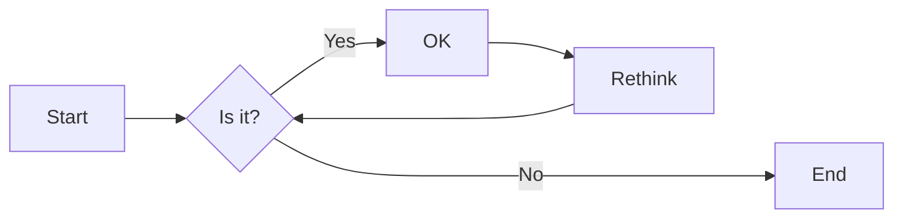

``` markdown

```

### 流程图方向

| 方向 | 语法 | 说明 |
|-----------|--------|-------------|
| 从左到右 | `graph LR` | 水平流程 |
| 从上到下 | `graph TD` | 垂直流程 |
| 从右到左 | `graph RL` | 反向水平 |
| 从下到上 | `graph BT` | 反向垂直 |

### 节点形状

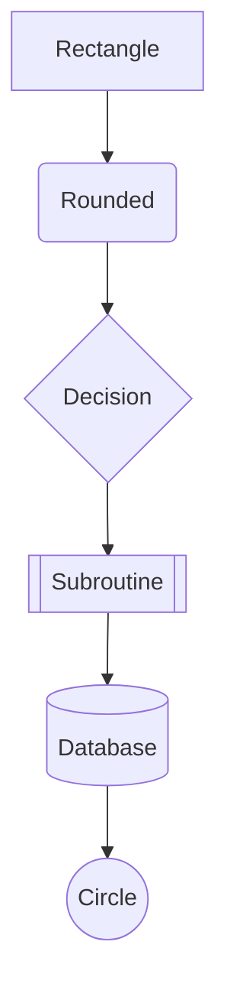

| 语法 | 形状 |
|--------|-------|
| `A[text]` | 矩形 |
| `A(text)` | 圆角 |
| `A{text}` | 菱形/决策 |
| `A[[text]]` | 子程序 |
| `A[(text)]` | 数据库 |
| `A((text))` | 圆形 |
| `A>text]` | 不对称 |
| `A{text}` | 菱形 |

---

## 序列图

展示实体之间随时间变化的交互：

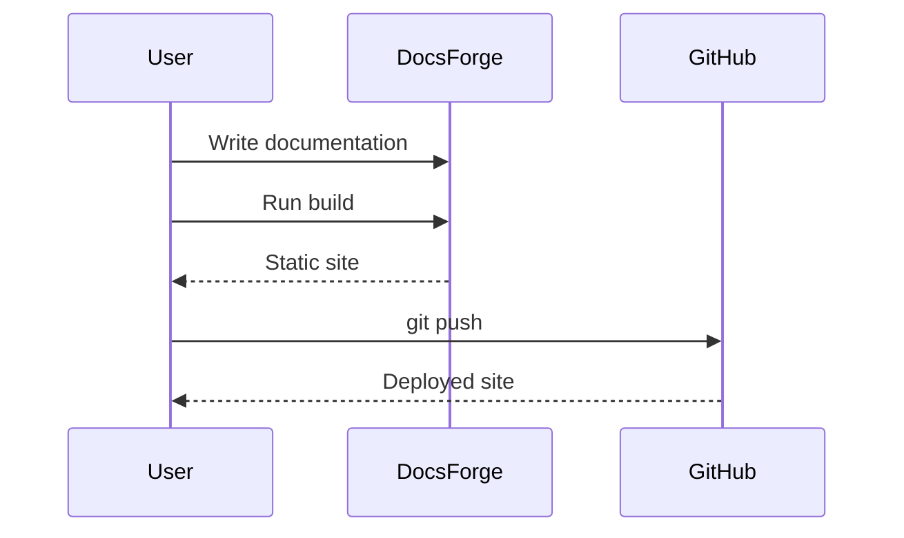

``` markdown

```

### 箭头类型

| 语法 | 含义 |
|--------|---------|
| `->` | 实线 |
| `-->` | 虚线 |
| `->>` | 实心箭头 |
| `-->>` | 虚线箭头 |
| `-x` | 实心叉 |
| `--x` | 虚线叉 |

---

## 类图

展示面向对象结构：

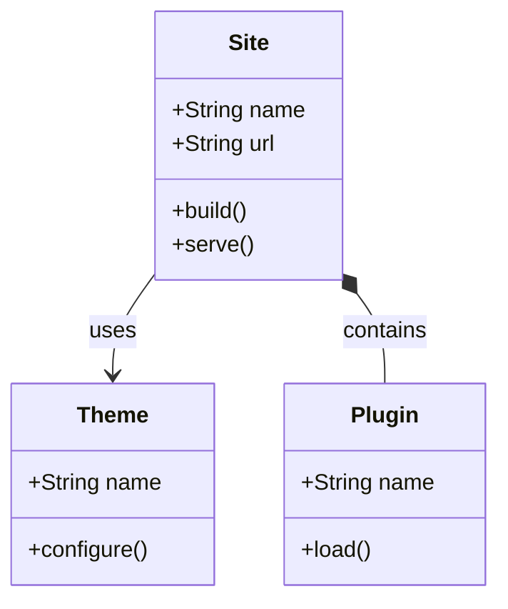

### 关系类型

| 语法 | 含义 |
|--------|---------|
| `-->` | 关联 |
| `*--` | 组合 |
| `o--` | 聚合 |
| `--|>` | 继承 |
| `..>` | 依赖 |
| `--` | 链接 |

---

## 状态图

展示状态机及其转换：

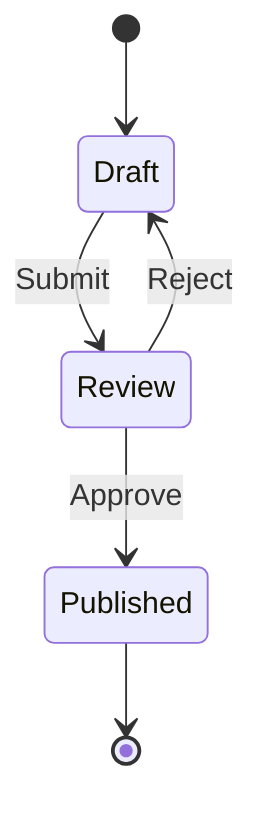

``` markdown

```

---

## 甘特图

展示项目时间线：

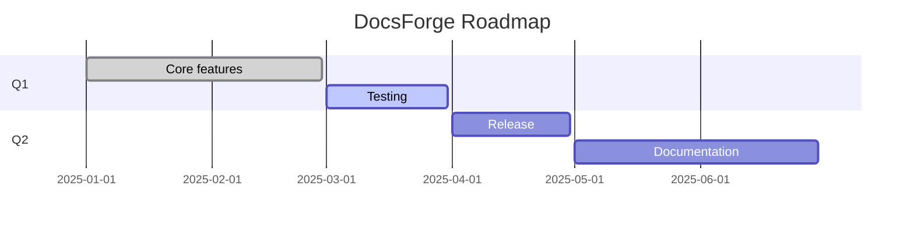

``` markdown

```

### 状态指示器

| 状态 | 语法 | 颜色 |
|--------|--------|-------|
| 已完成 | `:done,` | 绿色 |
| 进行中 | `:active,` | 蓝色 |
| 关键 | `:crit,` | 红色 |
| 默认 | `:,` | 灰色 |

---

## 饼图

展示比例数据：

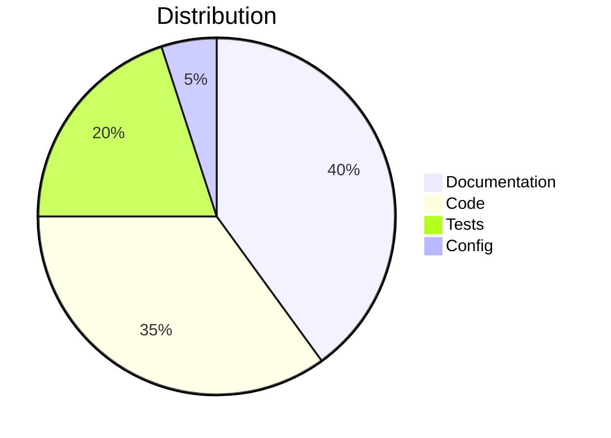

---

## Git 图

展示 Git 分支历史：

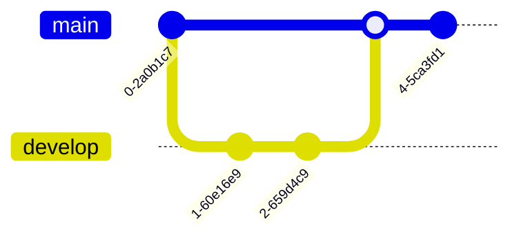

---

## 思维导图

展示层级概念：

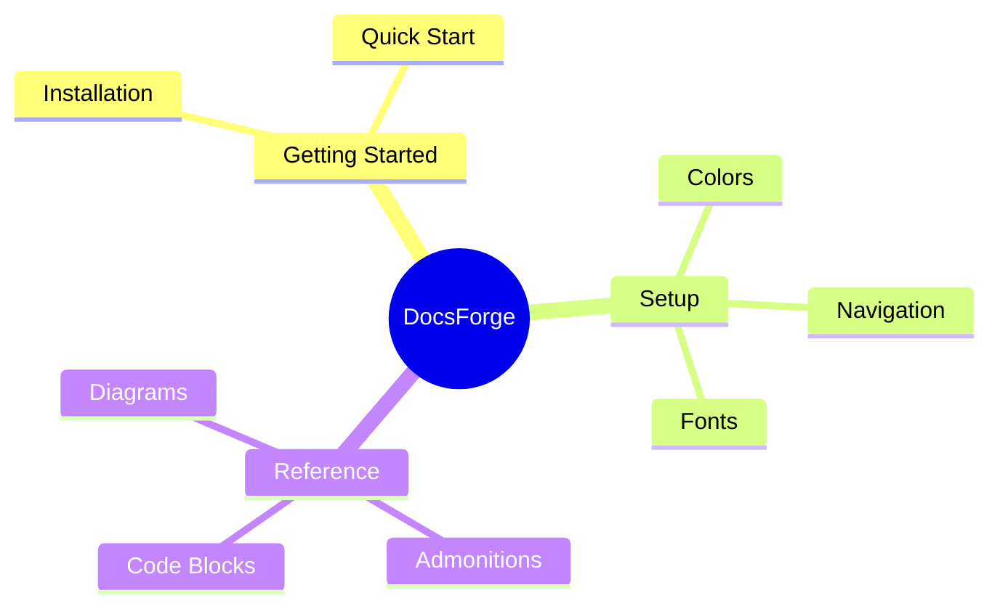

---

## 实体关系图

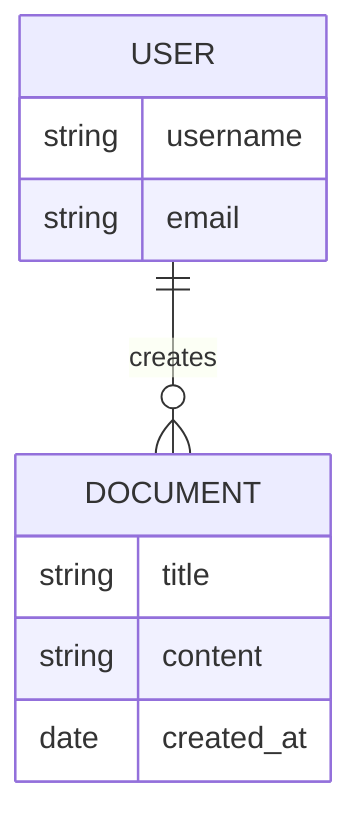

---

## 用户旅程

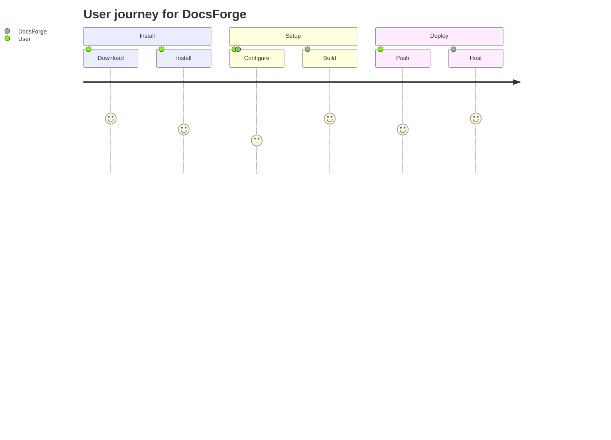

---

## C4 图（架构）

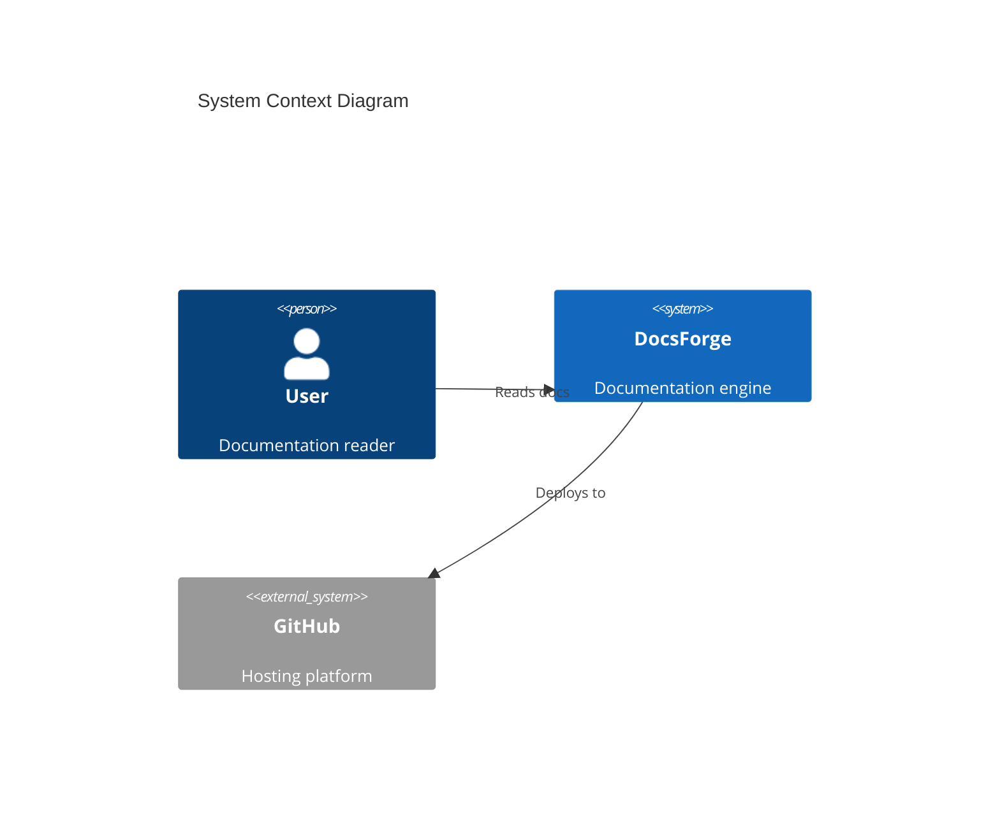

---

## 最佳实践

- 保持图表简洁——为保证可读性，节点数量最多 5-10 个
- 同一页面内使用一致的方向（全部 LR 或全部 TD）
- 为箭头添加标签（`-->|label|`）
- 谨慎使用颜色
- 在浅色和深色主题下测试图表
- 避免图表宽度超过内容区域
- 在复杂图表下方添加文字说明，以提升可访问性

---

## 故障排除

### 图表无法渲染

1. 检查 Mermaid 语法是否有效（可使用 [Mermaid Live Editor](https://mermaid.live)）
2. 确保使用 `` ```mermaid `` 围栏（而非 `` ``` ``）
3. 复杂图表可能需要显式启用 `mermaid` 扩展

### 文字过小

将大型图表拆分为较小的子图。可考虑使用 `subgraph`：

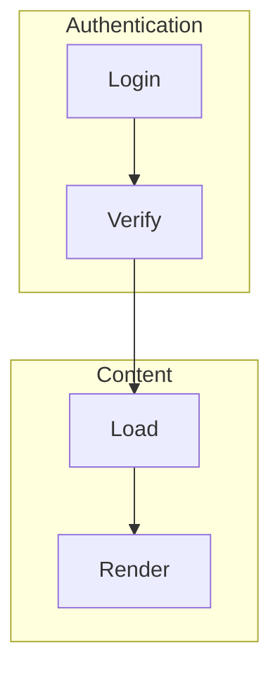

---

## 下一步

- [数据表格](data-tables.md)
- [格式化](formatting.md)
- [代码块](code-blocks.md)
