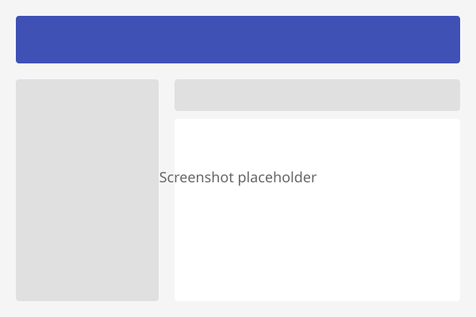

# 图片

DocsForge 为图片提供了增强的样式选项。图片默认响应式，并支持懒加载、对齐、尺寸调整等功能。

---

## 基础图片

标准 Markdown 语法：

``` markdown

```


请始终使用描述性的替代文本，以提升可访问性和 SEO。

---

## 带标题的图片

使用 `figure` 标签添加标题：

``` markdown
<figure markdown="span">
  
  <figcaption>文档站点预览</figcaption>
</figure>
```

<figure markdown="span">
  
  <figcaption>文档站点预览</figcaption>
</figure>

---

## 图片对齐

### 左对齐

``` markdown
{ align=left }
```

文字会环绕在图片右侧。

### 右对齐

``` markdown
{ align=right }
```

文字会环绕在图片左侧。

### 居中对齐

``` markdown
{ align=center }
```

图片居中显示，文字位于上下方。

---

## 图片尺寸

设置宽度：

``` markdown
{ width="300" }
```

按百分比设置宽度：

``` markdown
{ width="50%" }
```

同时设置宽度和高度：

``` markdown
{ width="300" height="200" }
```

!!! warning "宽高比"
    同时设置宽度和高度可能会导致图片变形。仅使用 `width` 可保持原始宽高比。

---

## 懒加载

图片默认懒加载。如需为首屏图片（如横幅）禁用懒加载：

``` markdown
{ loading=eager }
```

| 值 | 行为 |
|-------|----------|
| `lazy`（默认） | 图片进入视口时加载 |
| `eager` | 页面加载时立即加载 |

---

## 阴影效果

添加 subtle 阴影以增强层次感：

``` markdown
{ .shadow }
```

这适用于截图和 UI 原型，使其与页面背景区分开来。

---

## 图片链接

将图片设为链接：

``` markdown
[](https://example.com)
```

在新标签页打开：

``` markdown
[](https://example.com){ target="_blank" }
```

---

## 灯箱（点击放大）

DocsForge 支持图片灯箱模式。点击图片即可查看完整尺寸：

``` markdown
{ data-lightbox }
```

大多数图片会自动启用此功能，无需额外配置。

---

## 图片画廊

创建图片网格：

``` markdown
<div class="grid" markdown>


</div>
```

---

## 响应式图片

DocsForge 会自动使图片响应式。它们会：
- 缩放以适应容器
- 不超出内容区域
- 保持宽高比
- 适配所有屏幕尺寸

无需配置。

---

## 图片格式

推荐格式：

| 格式 | 适用场景 | 大小 |
|--------|----------|------|
| SVG | 徽标、图标、示意图 | 最小，可无限缩放 |
| WebP | 截图、照片 | 比 PNG/JPEG 小约 25% |
| PNG | 带透明背景的截图 | 无损，较大 |
| JPEG | 不带透明背景的照片 | 压缩效果好 |

### 转换为 WebP

``` bash
# 使用 cwebp
cwebp -q 85 image.png -o image.webp

# 使用 ImageMagick
convert image.png -quality 85 image.webp
```

---

## 优化建议

1. **尽可能使用 WebP** — 在相似画质下比 PNG/JPEG 更小
2. **在加入文档前压缩图片**（可使用 tinypng.com、ImageMagick 或 ffmpeg）
3. **使用 SVG** 作为徽标、图标和简单示意图
4. **尽量控制在 200KB 以内** — 大图会拖慢页面加载
5. **使用描述性替代文本** — 对可访问性和 SEO 很重要
6. **默认使用懒加载** — 仅对首屏图片使用 `eager`
7. **考虑深色模式** — 使用透明 PNG 或 SVG 以兼容深色主题

### 图片尺寸指南

| 类型 | 推荐尺寸 | 格式 |
|------|-----------------|--------|
| 徽标 | 200×50px | SVG |
| 截图 | 宽 800-1200px | WebP/PNG |
| 示意图 | 矢量 | SVG |
| 图标 | 24×24px | SVG |
| 横幅 | 1200×400px | WebP/JPEG |

---

## 下一步

- [图标与表情符号](icons-emojis.md)
- [列表](lists.md)
- [数据表格](data-tables.md)
