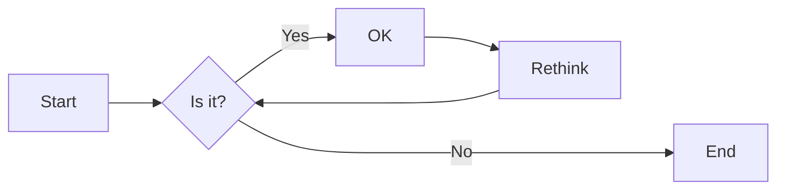
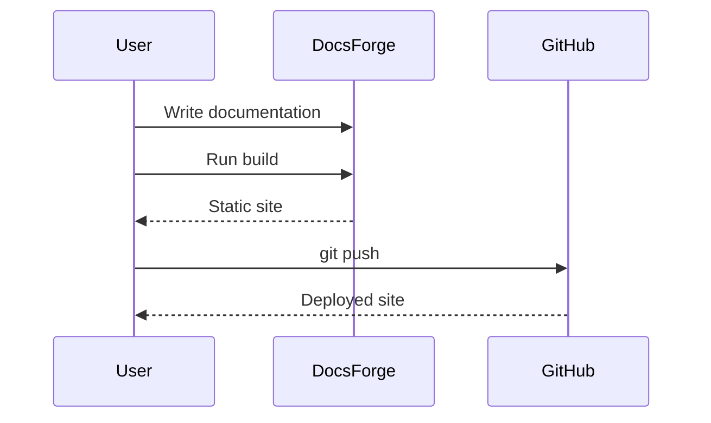
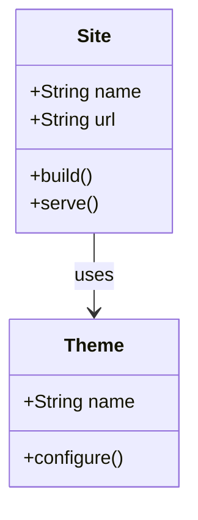
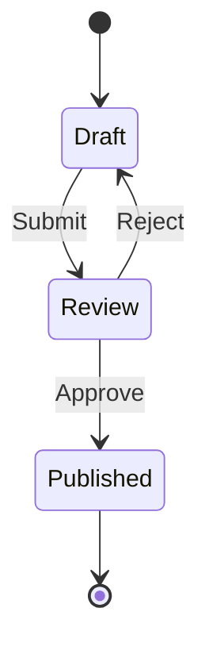
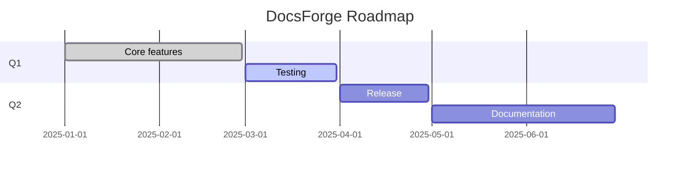
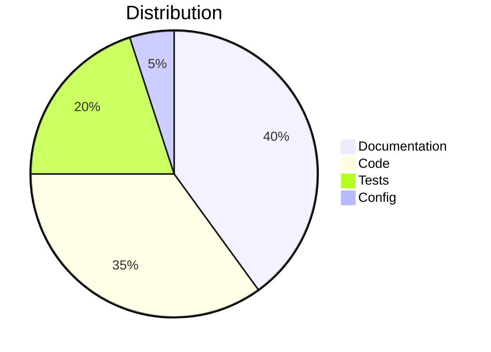
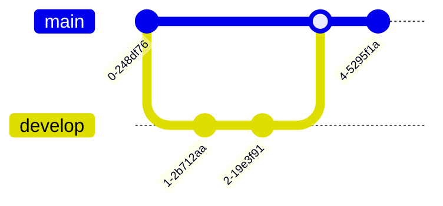
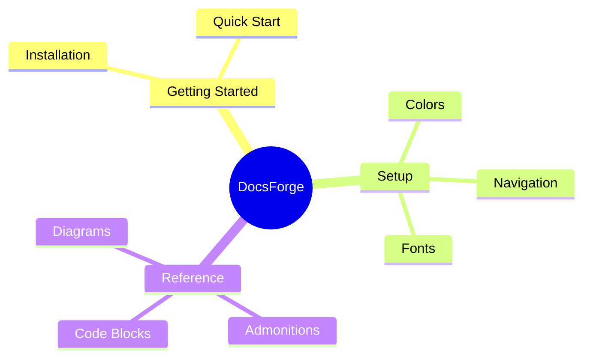

# Diagrams

DocsForge integrates [Mermaid.js](https://mermaid.js.org) for creating diagrams with text.

## Configuration

Mermaid support is enabled by default:

``` yaml
markdown_extensions:
  - pymdownx.superfences:
      custom_fences:
        - name: mermaid
          class: mermaid
          format: !!python/name:pymdownx.superfences.fence_code_format
```

## Flowchart



## Sequence diagram



## Class diagram



## State diagram



## Gantt chart



## Pie chart



## Git graph



## Mindmap



## Next steps

- [Data tables](data-tables.md)
- [Formatting](formatting.md)
