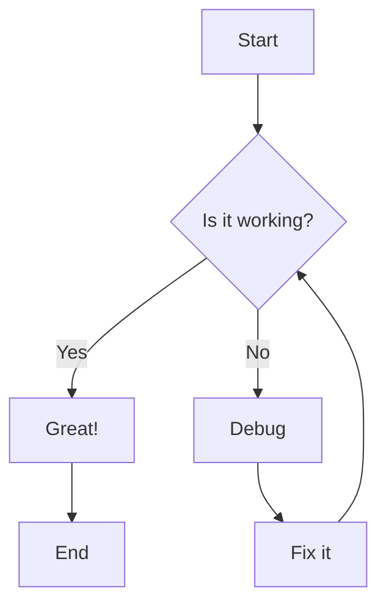
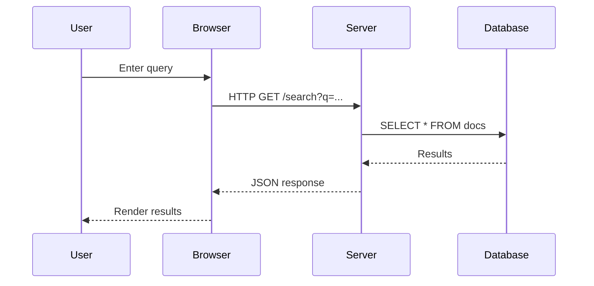
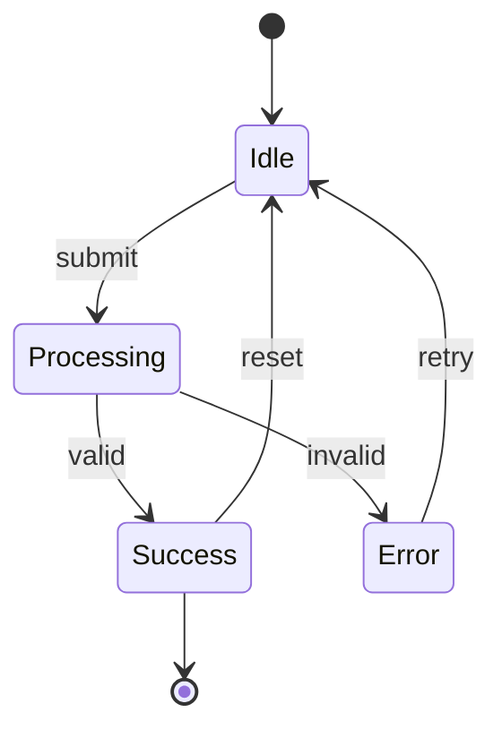
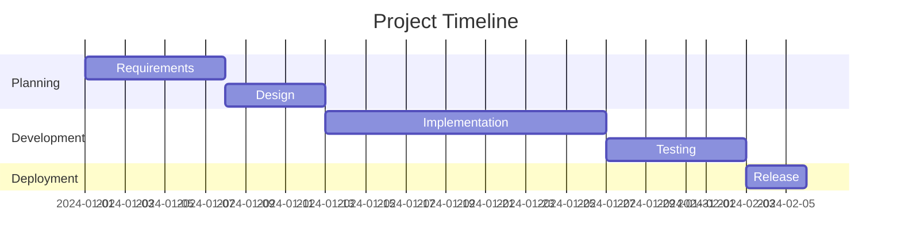
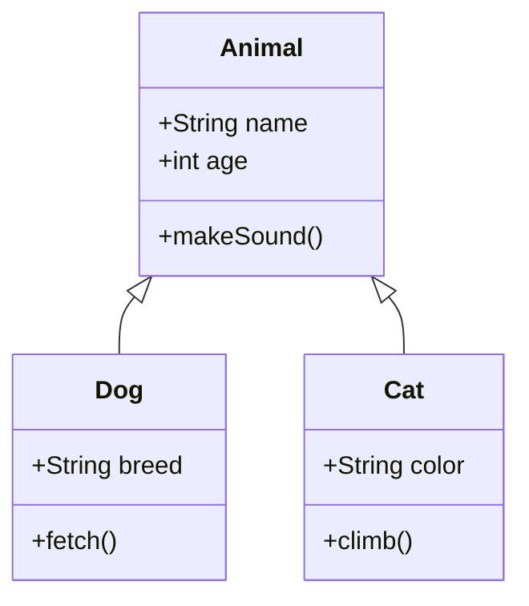

# Diagram Demo: Mermaid + TikZ

This page demonstrates both **Mermaid** (native Markdown) and **TikZ** (compiled to SVG) diagrams.

---

## Mermaid Diagrams

Mermaid diagrams are rendered natively by the documentation engine.

### Flowchart



### Sequence Diagram



### State Diagram



### Gantt Chart



### Class Diagram



---

## TikZ Diagrams

TikZ diagrams are written as `.tex` files, compiled to SVG, and embedded as images.

### Shannon Communication Model

*File: `assets/tikz/diagram.tex` → `assets/tikz/diagram.svg`*


> Classic Shannon-Weaver communication model with Information Source, Transmitter, Channel, Noise Source, Receiver, and Destination.

---

### Binary Entropy Function

*File: `assets/tikz/binary-entropy.tex` → `assets/tikz/binary-entropy.svg`*


> The binary entropy function $H(p) = -p \log_2 p - (1-p) \log_2 (1-p)$, fundamental to information theory.

---

### State Machine (Shannon Paper)

*File: `assets/tikz/shannon-state-machine.tex` → `assets/tikz/shannon-state-machine.svg`*


> Markov process state transition diagram from Shannon's "A Mathematical Theory of Communication".

---

### Algorithm Flowchart

*File: `assets/tikz/flowchart.tex` → `assets/tikz/flowchart.svg`*


> A simple flowchart demonstrating conditional logic with mathematical notation $x > 0$.

---

### Neural Network Architecture

*File: `assets/tikz/neural-network.tex` → `assets/tikz/neural-network.svg`*


> Feed-forward neural network with input, hidden, and output layers. Each layer shows the mathematical transformation.

---

## Comparison

| Feature | Mermaid | TikZ |
|---------|---------|------|
| Syntax | Text-based, simple | LaTeX-based, powerful |
| Math support | Limited / Unicode | Full LaTeX math |
| Custom styling | Theme-based | Pixel-perfect control |
| Compilation | None (native) | Requires `latex` → `dvisvgm` |
| Best for | Quick diagrams, collaboration | Publication-quality, complex math |
| Version control | Friendly | Friendly (source is text) |

---

## Build Process for TikZ

```bash
# 1. Compile .tex to .dvi
latex -interaction=nonstopmode diagram.tex

# 2. Convert .dvi to .svg
dvisvgm --no-fonts diagram.dvi -o diagram.svg

# Or use pdf2svg:
pdflatex diagram.tex
pdf2svg diagram.pdf diagram.svg
```

The SVG is then referenced in Markdown as a standard image:

```markdown

```
