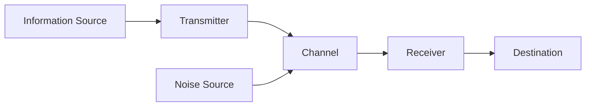

---
tags:
  - shannon
  - information-theory
  - math
---

# A Mathematical Theory of Communication

*By Claude E. Shannon — Bell System Technical Journal, Vol. 27, 1948*

This is a comprehensive, in-depth walkthrough of Shannon's foundational paper that created the field of **Information Theory**. Every section and appendix is documented with:

- Full mathematical derivations using inline and display equations
- Mermaid diagrams for system structures and flowcharts
- TiKz-generated SVG figures for precise mathematical illustrations
- Detailed explanations of every theorem, proof technique, and concept

---

## Paper Structure

| Part | Title | Sections |
|------|-------|----------|
| **Introduction** | — | Overview of communication problems |
| **Part I** | [Discrete Noiseless Systems](part-i/01-discrete-noiseless-channel.md) | §1–§10 |
| **Part II** | [The Discrete Channel with Noise](part-ii/11-noisy-channel-representation.md) | §11–§17 |
| **Part III** | [Mathematical Preliminaries](part-iii/18-sets-and-ensembles.md) | §18–§23 |
| **Part IV** | [The Continuous Channel](part-iv/24-capacity-of-continuous-channel.md) | §24–§26 |
| **Part V** | [The Rate for a Continuous Source](part-v/27-fidelity-evaluation.md) | §27–§29 |
| **Appendices** | [Six Appendices](appendices/appendix-1.md) | A1–A6 |

---

## The Five Parts at a Glance

### Part I: Discrete Noiseless Systems
Establishes the core concepts of information, entropy, and channel capacity in the simplest setting: discrete symbols transmitted without noise. The **Source Coding Theorem** (§9) states that lossless compression is bounded by source entropy.

Key equation — Shannon entropy:

$$
H = -\sum_{i=1}^{n} p_i \log p_i
$$

### Part II: The Discrete Channel with Noise
Extends the theory to noisy channels. Introduces **equivocation** $H_y(x)$, defines noisy channel capacity, and proves the **Noisy Channel Coding Theorem** (§13): reliable communication is possible at any rate below capacity.

### Part III: Mathematical Preliminaries
Rigorous foundations for continuous signals: sets of functions, ensembles, spectral analysis, and differential entropy. Prepares the ground for extending discrete results to continuous channels.

### Part IV: The Continuous Channel
Derives the famous **Shannon–Hartley Law** for additive white Gaussian noise:

$$
C = W \log_2\left(1 + \frac{P}{N}\right)
$$

where $W$ = bandwidth, $P$ = signal power, $N$ = noise power.

### Part V: The Rate for a Continuous Source
Introduces **rate-distortion theory**: the trade-off between compression rate and reconstruction fidelity. Defines the rate $R(D)$ as the minimum bits needed to represent a source with distortion at most $D$.

---

## Visual Overview: The Communication System

This schematic (Fig. 1 from the paper) represents every communication system Shannon analyzes. Each Part adds mathematical rigor to one or more of these blocks.

---

## Why This Paper Matters

Before Shannon, "information" was an intuitive concept. After Shannon:

- **Information became measurable** in bits
- **Compression limits** became provable (source coding theorem)
- **Error-free transmission over noise** became possible (channel coding theorem)
- **Bandwidth, power, and noise** were unified into one formula (Shannon–Hartley)
- **Lossy compression** was given a theoretical foundation (rate-distortion)

Every modern digital system — from 5G to streaming video to SSDs — traces back to these results.

---

## How to Read This Guide

1. Start with the **Introduction** below for context
2. Read **Part I** for the conceptual core (entropy, source coding)
3. Read **Part II** for the engineering heart (noisy channels, error correction)
4. Read **Part III** if you want the mathematical machinery
5. Read **Parts IV–V** for continuous signals and modern applications
6. Consult the **Appendices** for detailed proofs

!!! tip "Prerequisites"
    - Basic probability theory (random variables, expectation)
    - Calculus (limits, integrals, basic Fourier concepts)
    - Linear algebra (matrices, eigenvalues) for Part III
    - For Part IV: familiarity with signals and systems helps

---

## Further Reading

- Shannon, C. E. & Weaver, W. *The Mathematical Theory of Communication* (University of Illinois Press, 1949) — book version with Weaver's philosophical interpretation
- Cover, T. M. & Thomas, J. A. *Elements of Information Theory* (Wiley, 2006) — modern textbook
- MacKay, D. J. C. *Information Theory, Inference, and Learning Algorithms* (Cambridge, 2003) — freely available online

---

*Converted from the original Bell System Technical Journal reprint, July/October 1948.*
