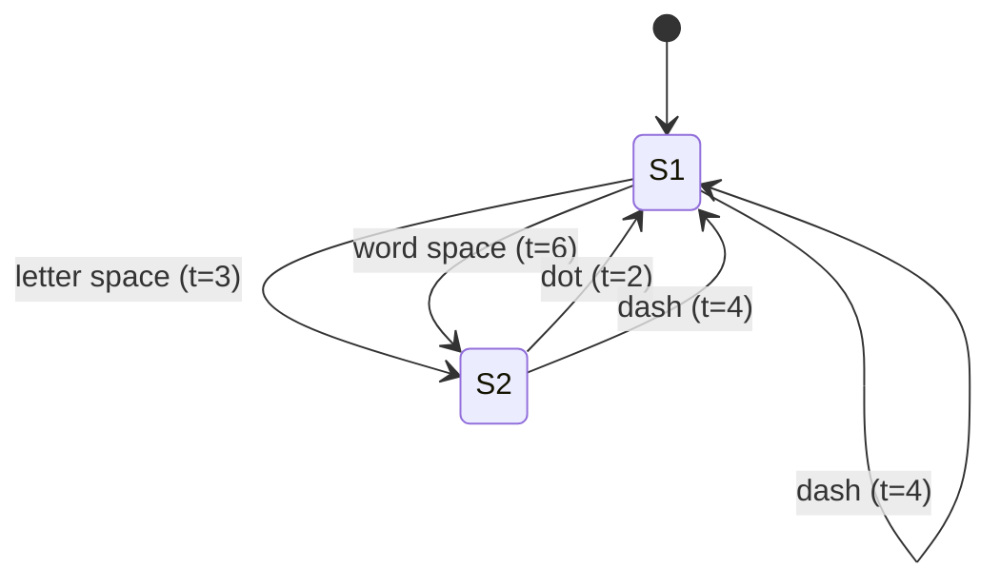

---
tags:
  - information-theory
  - channel-capacity
  - discrete
---

# 1. The Discrete Noiseless Channel

## What Is a Discrete Channel?

A **discrete channel** is any system that transmits a sequence of symbols chosen from a finite alphabet, one after another, from a sender to a receiver. The channel is **noiseless** if every symbol sent arrives exactly as sent — no errors, no distortion.

Classic examples:
- **Teletype**: 32 symbols (letters, numbers, control characters), all of equal duration
- **Morse code**: dots, dashes, and spaces of different durations
- **Digital binary link**: sequences of 0s and 1s

## The Core Question

> Given a channel with certain rules about which symbol sequences are allowed and how long each symbol takes, how much information can it carry per unit time?

Shannon answers this by defining **channel capacity** as a fundamental limit.

---

## Defining Capacity

Let $S_1, S_2, \ldots, S_n$ be the elementary symbols. Each symbol $S_i$ has duration $t_i$ seconds. Not all sequences may be allowed — the channel may impose constraints.

Let $N(T)$ = number of **allowed signals** of total duration $T$.

Shannon defines:

$$
C = \lim_{T \to \infty} \frac{\log N(T)}{T}
$$

This limit exists and is finite for all reasonable channels. The base of the logarithm determines units:
- Base 2 → **bits per second**
- Base $e$ → **nats per second**
- Base 10 → **decimal digits per second**

!!! note "Why logarithmic?"
    If you double the transmission time, the number of possible sequences roughly squares, so $\log N(T)$ doubles. The logarithm converts multiplicative growth into additive, linear growth — exactly what we want for a "rate."

---

## Simple Case: Equal Durations, No Restrictions

If all $n$ symbols have the same duration $\tau$ and any sequence is allowed:

- There are $n$ symbols, so each carries $\log_2 n$ bits
- If the system sends $r$ symbols per second: $r = 1/\tau$
- Capacity: $C = r \log_2 n$ bits/second

For teletype with 32 symbols: $C = 5r$ bits/second (since $\log_2 32 = 5$).

---

## General Case: Unequal Durations, No Restrictions

Suppose all sequences are allowed, but symbols have durations $t_1, t_2, \ldots, t_n$.

Let $N(t)$ = number of allowed sequences of duration $t$. The recurrence:

$$
N(t) = N(t - t_1) + N(t - t_2) + \cdots + N(t - t_n)
$$

This is a linear difference equation. For large $t$, $N(t) \sim X_0^t$ where $X_0$ is the **largest real root** of the **characteristic equation**:

$$
X^{-t_1} + X^{-t_2} + \cdots + X^{-t_n} = 1
$$

Therefore:

$$
C = \log X_0
$$

!!! example "Telegraph Example"
    Telegraph symbols:
    - Dot: 2 units (1 closed + 1 open)
    - Dash: 4 units (3 closed + 1 open)
    - Letter space: 5 units (3 open, but equivalent constraints)
    - Word space: 7 units

    With constraints that no two spaces follow each other, the characteristic equation becomes:
    $$X^{-2} + X^{-4} + X^{-5} + X^{-7} + X^{-8} + X^{-10} = 1$$
    Solving numerically: $X_0 \approx 1.453$, so $C \approx 0.539$ bits per unit time.

---

## State-Based Restrictions

A very general class of restrictions: imagine the channel has **states** $a_1, a_2, \ldots, a_m$. From state $i$, only certain symbols can be sent, and sending symbol $s$ transitions to a new state $j$.

**Theorem 1** (Shannon): Let $b_{ij}^{(s)}$ be the duration of the $s$-th symbol allowable in state $i$ leading to state $j$. Then:

$$
C = \log W
$$

where $W$ is the largest real root of:

$$
\det\left| \sum_s W^{-b_{ij}^{(s)}} - \delta_{ij} \right| = 0
$$

with $\delta_{ij} = 1$ if $i = j$ and $0$ otherwise.

This determinant equation compactly captures all state-transition constraints. For the telegraph case with two states ("just sent a space" vs "did not"), expanding the determinant recovers the characteristic equation above.

---

## Key Takeaways

| Concept | Meaning |
|---------|---------|
| $N(T)$ | Count of allowed signals of duration $T$ |
| $C = \lim \frac{\log N(T)}{T}$ | Maximum information rate the channel can support |
| Characteristic equation | Encodes symbol durations and constraints |
| $X_0$ or $W$ | Growth rate of allowed sequences |
| State model | General framework for complex constraints |

Channel capacity depends **only** on the channel's rules and symbol timings — not on what source feeds it. Whether the actual transmission achieves $C$ depends on how the source encodes its messages, which is the subject of the next sections.

---

*Next: [§2 — The Discrete Source of Information](02-discrete-source.md)*
