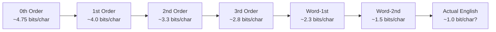

---
tags:
  - information-theory
  - markov
  - natural-language
---

# 3. The Series of Approximations to English

## Building Intuition Through Examples

To make the abstract concepts of Section 2 concrete, Shannon constructs six progressively more realistic approximations to English text. Each adds a layer of statistical structure, demonstrating how structure reduces entropy and increases predictability.

---

## The Six Approximations

### 1. Zero-Order Approximation
**Symbols independent and equiprobable.**

```
XFOML RXKHRJFFJUJ ZLPWCFWKCYJ FFJEYVKCQSGHYD QPAAMKBZAACIBZLHJQD
```

Every letter A–Z plus space has equal probability $1/27$. This is **maximum entropy** English — completely garbled, no structure at all.

Entropy per character: $\log_2 27 \approx 4.75$ bits.

---

### 2. First-Order Approximation
**Symbols independent but with frequencies of English text.**

```
OCRO HLI RGWR NMIELWIS EU LL NBNESEBYA TH EEI ALHENHTTPA OOBTTVA NAH BRL
```

"E" and "T" and space appear often; "Z" and "Q" rarely. But letters are still chosen independently — no digram structure. You get vaguely English-like frequency but impossible sequences.

Entropy per character: approximately 4.0 bits (estimated from letter frequencies).

---

### 3. Second-Order Approximation
**Digram structure as in English.**

```
ON IE ANTSOUTINYS ARE T INCTORE ST BE S DEAMY ACHIN D ILONASIVE TUCOOWE
AT TEASONARE FUSO TIZIN ANDY TOBE SEACE CTISBE
```

Now $P(x_k \mid x_{k-1})$ matches English. "TH" appears, "Q" is almost always followed by "U". Short sequences look English-like, but longer stretches drift into nonsense.

Entropy per character: approximately 3.3 bits.

---

### 4. Third-Order Approximation
**Trigram structure as in English.**

```
IN NO IST LAT WHEY CRATICT FROURE BIRS GROCID PONDENOME OF DEMONSTURES OF
THE REPTAGIN IS REGOACTIONA OF CRE
```

Trigram probabilities $P(x_k \mid x_{k-1}, x_{k-2})$ capture more context. Most short words look real ("IN", "NO", "THE", "OF"), though the overall meaning is still absent.

Entropy per character: approximately 2.8 bits.

---

### 5. First-Order Word Approximation
**Word frequencies correct, words independent.**

```
REPRESENTING AND SPEEDILY IS AN GOOD APT OR COME CAN DIFFERENT NATURAL HERE
HE THE A IN CAME THE TO OF TO EXPERT GRAY COME TO FURNISHES THE LINE MESSAGE
HAD BE THESE
```

Instead of letter transitions, we use English word frequencies (from frequency tables). Words are chosen independently — grammar is violated, but individual words are real English.

Entropy per word: higher, but per character lower due to word structure.

---

### 6. Second-Order Word Approximation
**Word transition probabilities are correct.**

```
THE HEAD AND IN FRONTAL ATTACK ON AN ENGLISH WRITER THAT THE CHARACTER OF
THIS POINT IS THEREFORE ANOTHER METHOD FOR THE LETTERS THAT THE TIME OF WHO
EVER TOLD THE PROBLEM FOR AN UNEXPECTED
```

Now $P(w_k \mid w_{k-1})$ matches English. The result is surprisingly readable — many phrases are grammatically correct, though the overall paragraph has no coherent meaning.

---

## The Entropy Ladder



Each step down the ladder adds statistical constraints, reducing the entropy (uncertainty) per symbol. The lower bound is the **true entropy of English** — how much information each character actually conveys, given perfect knowledge of all statistical structure.

Shannon estimated true English entropy at roughly **1 bit per character** (with considerable uncertainty in the estimate).

---

## Why These Approximations Matter

1. **They make entropy concrete**: You can see how predictability increases
2. **They validate the stochastic model**: Natural language really does behave like a Markov process
3. **They show the compression potential**: If English has 1 bit/char entropy but 26 letters need ~4.7 bits to encode naively, there's a 4:1 compression opportunity
4. **They motivate coding schemes**: Huffman coding (later, 1952) and arithmetic coding achieve these limits

---

## Entropy Estimation from Approximations

If $H_n$ is the entropy per character for $n$-th order approximation, then:

$$
H_0 > H_1 > H_2 > H_3 > \cdots > H_{\infty} = H_{\text{English}}
$$

The sequence is monotone decreasing and bounded below by 0, so it converges. The limit is the true entropy rate.

Shannon's word-level approximations suggest the limit is well below 2 bits/character. Modern estimates using large language models suggest even lower — perhaps 0.5–1.0 bits/character.

---

*Next: [§4 — Graphical Representation of a Markoff Process](04-markoff-process-graphs.md)*
