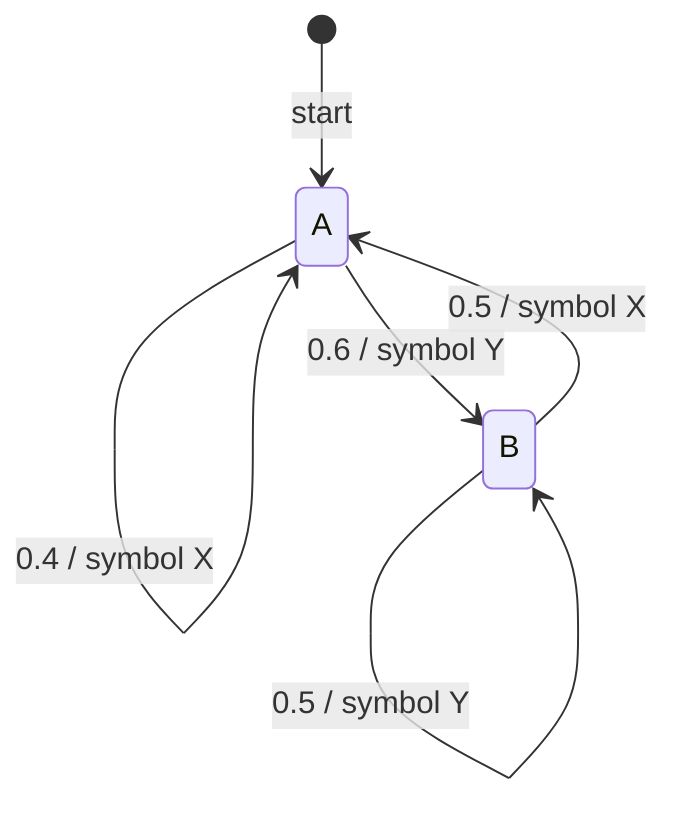
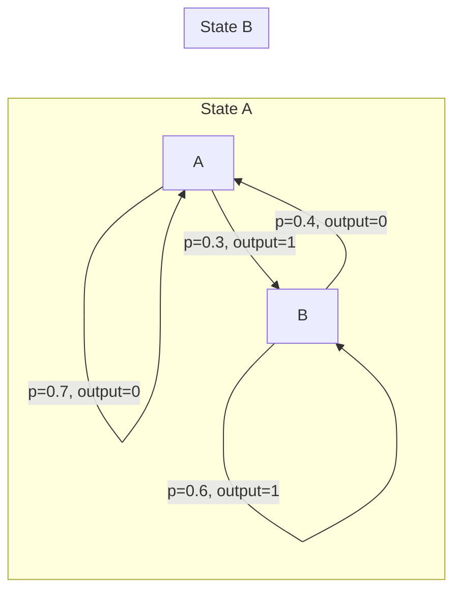

---
tags:
  - information-theory
  - markov
  - graph-theory
---

# 4. Graphical Representation of a Markoff Process

## Visualizing Stochastic Sources

A discrete source with memory is a **Markov process** (Shannon uses the older spelling "Markoff"). The state of the system plus the current output symbol determine the next state. Linear graphs provide an intuitive picture of these transitions.

---

## Graph Structure

- **Junction points (nodes)**: States $a_1, a_2, \ldots, a_m$
- **Directed lines (edges)**: Possible symbols, labeled with:
  - The symbol $S_k$
  - Its probability of being chosen from that state
  - The resulting state transition

For the telegraph example (Section 1):

| State | Meaning | Allowed Next | Transition |
|-------|---------|------------|------------|
| $a_1$ | Last symbol was NOT a space | dot, dash, letter space, word space | stays $a_1$ unless space sent |
| $a_2$ | Last symbol WAS a space | dot, dash only | always goes to $a_1$ |

---

## Formal Definition

A Markoff process with $m$ states and $n$ symbols is defined by:

$$
p_i(j,s) = \text{probability of symbol } s \text{ in state } i \text{ leading to state } j
$$

With constraints:

$$
\sum_{j,s} p_i(j,s) = 1 \quad \text{for all } i
$$

The **stationary distribution** $P_i$ satisfies:

$$
P_j = \sum_i P_i \sum_s p_i(j,s)
$$

This is the long-run proportion of time spent in state $j$.

---

## The Entropy of a Markoff Source

For each state $i$, define the **state entropy**:

$$
H_i = -\sum_{j,s} p_i(j,s) \log p_i(j,s)
$$

The **source entropy rate** (per step) is:

$$
H = \sum_i P_i H_i
$$

This can also be written in terms of the **joint entropy** of state-symbol pairs.

---

## Why Graphs Are Powerful

1. **Ergodicity check at a glance**: Can you get from any state to any other? (More in §5)
2. **Constraint visualization**: Forbidden sequences are simply missing edges
3. **Capacity calculation**: The determinant method of §1 applies directly
4. **Source modeling**: Natural language, error-correcting codes, and compression all use this framework

---

## Example: Simple Two-State Source

Transition matrix for states:

$$
T = \begin{bmatrix} 0.7 & 0.3 \\ 0.4 & 0.6 \end{bmatrix}
$$

Stationary distribution: solve $P = PT$:

$$
P_A = \frac{4}{7}, \quad P_B = \frac{3}{7}
$$

State entropies:

$$
H_A = -(0.7\log 0.7 + 0.3\log 0.3) \approx 0.881 \text{ bits}
$$

$$
H_B = -(0.4\log 0.4 + 0.6\log 0.6) \approx 0.971 \text{ bits}
$$

Source entropy:

$$
H = \frac{4}{7}(0.881) + \frac{3}{7}(0.971) \approx 0.920 \text{ bits/symbol}
$$

---

*Next: [§5 — Ergodic and Mixed Sources](05-ergodic-mixed-sources.md)*
