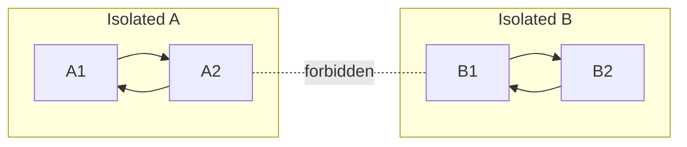

---
tags:
  - information-theory
  - ergodic-theory
  - stochastic-process
---

# 5. Ergodic and Mixed Sources

## The Ergodic Property

Not all stochastic sources are created equal. For the theorems in this paper to hold, we need sources where **time averages equal ensemble averages**. This is the **ergodic property**.

In plain language: if you watch one source run forever, the frequencies you observe match the probabilities defined by the model. Every long sample from the source looks statistically the same.

---

## Defining Ergodicity for Markoff Processes

A Markoff process is **ergodic** if its graph satisfies two conditions:

### Condition 1: Connectedness
The graph does not consist of two isolated parts $A$ and $B$ such that it is impossible to go from any state in $A$ to any state in $B$.

If this were allowed, the process could get trapped in $A$ or $B$ forever, and time averages would depend on initial conditions.

### Condition 2: No Periodic Cycles
A closed series of lines in the graph with all arrows pointing in the same orientation will be called a **circuit**. The graph must not consist of a single circuit (or multiple disconnected circuits).

In other words: the process shouldn't be periodic. You shouldn't be able to predict exactly where you'll be after $k$ steps.

---

## Why Ergodicity Matters

For an ergodic process:

1. **Unique stationary distribution**: There is exactly one set of state probabilities $P_i$ satisfying $P = PT$
2. **Convergence**: No matter where you start, the state distribution converges to $P_i$
3. **Law of Large Numbers**: Long-run frequencies equal probabilities
4. **Entropy is well-defined**: $H = \sum P_i H_i$ is a single number, not dependent on initial conditions

!!! warning "Non-Ergodic Sources"
    If a source violates either condition, the theorems of this paper may fail. For example, a source with two disconnected components produces sequences that are either "type A" or "type B" forever — the entropy of a single sequence does not equal the ensemble entropy.

---

## Mixed Sources

A **mixed source** is composed of several pure ergodic components, each with probability $q_i$:

$$
\text{Source} = q_1 \times \text{Ergodic}_1 + q_2 \times \text{Ergodic}_2 + \cdots + q_n \times \text{Ergodic}_n
$$

When you sample from a mixed source, you first pick a component according to $q_i$, then generate from that component forever.

A mixed source is **not ergodic** (it violates Condition 1 — you can never switch components).

### Entropy of a Mixed Source

The **ensemble entropy** is:

$$
H_{\text{ensemble}} = \sum_i q_i H_i - \sum_i q_i \log q_i
$$

The second term accounts for uncertainty about which component was chosen. However, any **single realization** has entropy equal to its component's entropy $H_i$ — not the ensemble average.

This is why ergodicity is essential: we want every long sequence to have the same entropy rate.

---

## The Asymptotic Equipartition Property (Preview)

For an ergodic source, Shannon proves (§6 and Appendix 3) that:

> Almost all long sequences of length $N$ have probability approximately $2^{-NH}$

This is the **AEP** — the foundation of lossless source coding. It says: among all $n^N$ possible sequences, only about $2^{NH}$ are "typical" and carry essentially all the probability mass. The rest are exponentially unlikely.

---

## Summary Table

| Property | Ergodic Source | Mixed Source |
|----------|---------------|------------|
| Components | One | Multiple |
| Switching? | No | Once, at start |
| Time = Ensemble? | Yes | No |
| Stationary distribution | Unique | Depends on component |
| Entropy per realization | Always $H$ | Either $H_1$ or $H_2$ or ... |
| Coding theorems apply? | Yes | Need separate treatment |

---

*Next: [§6 — Choice, Uncertainty and Entropy](06-choice-uncertainty-entropy.md)*
