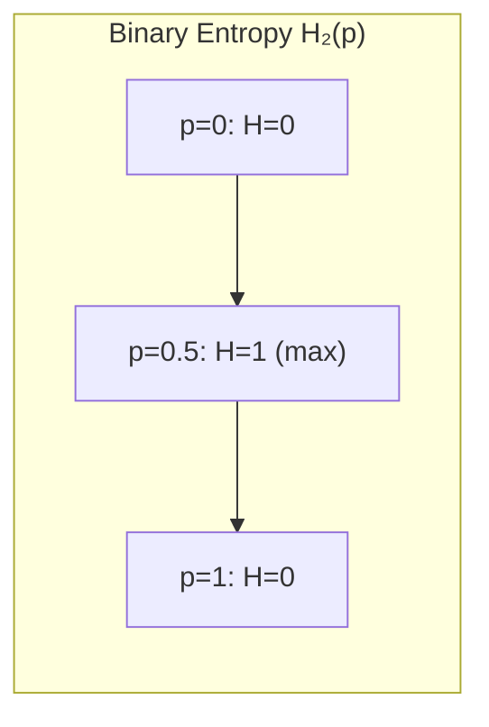

---
tags:
  - information-theory
  - entropy
  - axiomatic
---

# 6. Choice, Uncertainty and Entropy

## The Central Quantity of Information Theory

This section defines the mathematical measure of information — **entropy** — and derives it from intuitive axioms. This is the most famous section of Shannon's paper; the entropy formula appears on T-shirts, in textbooks, and at the heart of every compression algorithm and error-correcting code.

---

## The Setup

Consider a set of $n$ possible events with probabilities $p_1, p_2, \ldots, p_n$ (where $\sum p_i = 1$). We want a quantity $H(p_1, \ldots, p_n)$ that measures the **uncertainty** or **choice** inherent in this distribution.

Shannon imposes three axioms that any reasonable measure should satisfy:

---

## Axiom 1: Continuity

$H$ should be a **continuous function** of the $p_i$.

**Why:** Small changes in probabilities should produce small changes in uncertainty. If $p$ shifts from 0.5 to 0.5001, the information measure shouldn't jump discontinuously.

---

## Axiom 2: Monotonicity for Uniform Distributions

If all $p_i = 1/n$ (uniform distribution), then $H$ should be a **monotonic increasing function** of $n$.

**Why:** With equally likely outcomes, more choices = more uncertainty. A fair coin ($n=2$) has less uncertainty than a fair die ($n=6$).

---

## Axiom 3: Composition (Additivity)

If a choice is broken down into two successive choices, the original $H$ should equal the **weighted sum** of the individual values of $H$.

**Example:** Suppose we have three choices $A, B, C$ with probabilities $p_A = 1/2$, $p_B = 1/3$, $p_C = 1/6$.

Instead of choosing directly, we could first decide "A or (B,C)" with probabilities $1/2$ and $1/2$, then if (B,C), choose B or C with probabilities $2/3$ and $1/3$.

The axiom requires:

$$
H\left(\frac{1}{2}, \frac{1}{3}, \frac{1}{6}\right) = H\left(\frac{1}{2}, \frac{1}{2}\right) + \frac{1}{2} H\left(\frac{2}{3}, \frac{1}{3}\right)
$$

**Why:** Information should be additive across independent decision stages. This is the most powerful axiom — it forces the logarithmic form.

---

## Theorem: The Only Solution Is Entropy

**Theorem:** The only function satisfying Axioms 1–3 is:

$$
H = -K \sum_{i=1}^{n} p_i \log p_i
$$

where $K$ is a positive constant (choice of unit).

### Proof Sketch

1. From Axiom 3, show that for rational probabilities $p_i = n_i / \sum n_j$, the function must satisfy:
   $$H\left(\frac{1}{n}, \ldots, \frac{1}{n}\right) = A(n) \cdot K$$
   where $A(n)$ is additive: $A(mn) = A(m) + A(n)$.

2. By Axiom 2, $A(n)$ is monotonic. The only monotonic additive function is $A(n) = K \log n$.

3. Extend from uniform to arbitrary rational probabilities using Axiom 3 (composition).

4. Extend to all real probabilities by Axiom 1 (continuity).

---

## The Entropy Formula

Choosing $K = 1$ and base-2 logarithms (measuring in **bits**):

$$
\boxed{H = -\sum_{i=1}^{n} p_i \log_2 p_i}
$$

For a continuous distribution with density $p(x)$:

$$
H = -\int p(x) \log p(x) \, dx
$$

---

## Key Properties of Entropy

### 1. Zero for Certain Outcomes

$H = 0$ if and only if one $p_i = 1$ and all others are 0.

There is no uncertainty when the outcome is predetermined.

### 2. Maximum for Uniform Distribution

For fixed $n$, $H$ is maximized when all $p_i = 1/n$:

$$
H_{\max} = \log n
$$

This is the **principle of maximum entropy**: the most uncertain distribution is the uniform one.

### 3. Joint Entropy

For two events $x$ and $y$:

$$
H(x, y) = H(x) + H_x(y) = H(y) + H_y(x)
$$

where $H_x(y)$ is the **conditional entropy** of $y$ given $x$.

### 4. Subadditivity

$$
H(x, y) \leq H(x) + H(y)
$$

with equality if and only if $x$ and $y$ are independent.

Knowing the joint distribution never requires more bits than knowing each variable separately.

### 5. Entropy Never Decreases with Conditioning Removal

For any $x, y$:

$$
H_x(y) \leq H(y)
$$

Knowledge of $x$ never increases uncertainty about $y$. If $x$ and $y$ are independent, $H_x(y) = H(y)$. Otherwise, conditioning reduces (or preserves) entropy.

### 6. Concavity

$H(p_1, \ldots, p_n)$ is a concave function of its arguments. This means mixing distributions increases entropy:

$$
H(\lambda p + (1-\lambda) q) \geq \lambda H(p) + (1-\lambda) H(q)
$$

### 7. Any Equalization Increases Entropy

If we replace $p_1, p_2$ by their average $\frac{p_1 + p_2}{2}, \frac{p_1 + p_2}{2}$ (holding others fixed), $H$ increases.

More uniform = more uncertain = higher entropy.

---

## The Binary Entropy Function

For a binary variable with probabilities $p$ and $1-p$:

$$
H_2(p) = -p \log_2 p - (1-p) \log_2 (1-p)
$$

- $H_2(0) = H_2(1) = 0$ (certain outcome)
- $H_2(0.5) = 1$ bit (maximum uncertainty for a fair coin)
- Symmetric: $H_2(p) = H_2(1-p)$

---

## Entropy as Expected Information

If event $i$ occurs, the "surprise" or "information content" is:

$$
I_i = -\log p_i
$$

Rare events (low $p_i$) carry more information. Entropy is the **expected surprise**:

$$
H = \mathbb{E}[I] = \sum p_i (-\log p_i)
$$

---

## Summary Table

| Property | Formula | Interpretation |
|----------|---------|----------------|
| Certain outcome | $H = 0$ | No uncertainty |
| Uniform max | $H = \log n$ | Maximum uncertainty |
| Joint entropy | $H(x,y) = H(x) + H_x(y)$ | Additive over conditions |
| Independence | $H(x,y) = H(x) + H(y)$ | No shared information |
| Conditioning | $H_x(y) \leq H(y)$ | Knowledge reduces uncertainty |
| Concavity | $H(\lambda p + (1-\lambda)q) \geq \lambda H(p) + (1-\lambda)H(q)$ | Mixing increases entropy |

---

*Next: [§7 — The Entropy of an Information Source](07-entropy-of-source.md)*
