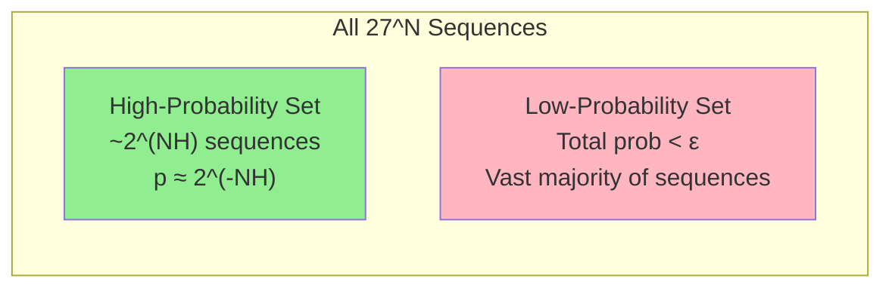

---
tags:
  - information-theory
  - entropy
  - markov
---

# 7. The Entropy of an Information Source

## From General Entropy to Source Entropy

Section 6 defined entropy for a static probability distribution. Now we apply it to a **dynamical source** that emits symbols over time, possibly with memory of previous symbols.

---

## Finite-State Sources

The most general discrete source Shannon considers is a **finite-state type**: at any time, the source is in one of a finite number of states $i \in \{1, \ldots, m\}$.

From state $i$:
- A set of possible symbols $j$ can be emitted
- Each with probability $p_i(j)$
- Emitting symbol $j$ transitions to a new state (deterministically or probabilistically)

---

## State Entropy and Source Entropy

For each state $i$, define the **state entropy**:

$$
H_i = -\sum_j p_i(j) \log p_i(j)
$$

This measures the uncertainty of the next symbol when we know we're in state $i$.

The **overall source entropy** (per emitted symbol) is the average over states, weighted by the stationary state probabilities $P_i$:

$$
\boxed{H = \sum_{i=1}^{m} P_i H_i = -\sum_{i,j} P_i \, p_i(j) \log p_i(j)}
$$

If the source has no memory (independent symbols), there's only one state, and this reduces to:

$$
H = -\sum_j p(j) \log p(j)
$$

---

## The Entropy Per Symbol of English

Shannon estimated the entropy rate of printed English using multiple methods:

### Method 1: N-gram Approximations
From the approximations in §3:
- Zero-order: $\approx 4.75$ bits/letter
- First-order: $\approx 4.0$ bits/letter
- Second-order: $\approx 3.3$ bits/letter
- Third-order: $\approx 2.8$ bits/letter
- Word-level approximations suggest $\approx 1.0$ bit/letter

### Method 2: Human Prediction
Shannon had subjects guess the next letter in English text, one letter at a time. From the number of guesses needed, he inferred entropy $\approx 1.0$ bit/character.

### Modern Estimates
Using large language models trained on massive corpora:
- **Printed English**: $\approx 0.6$–$1.3$ bits/character
- **Conversational English**: slightly higher (more variable)
- **Code/technical text**: often lower (more predictable)

---

## Entropy Rate vs. Per-Symbol Entropy

For a stationary ergodic source, define the **entropy rate** as:

$$
H_{\infty} = \lim_{N \to \infty} \frac{H(X_1, X_2, \ldots, X_N)}{N}
$$

This exists and equals the per-symbol entropy computed above. For an $n$-th order Markov source, the entropy rate is exactly the formula in the box above.

The entropy rate can also be expressed as:

$$
H_{\infty} = \lim_{N \to \infty} H(X_N \mid X_{N-1}, \ldots, X_1)
$$

The conditional entropy of the next symbol given all past symbols.

---

## Typical Sequences and the AEP

For an ergodic source with entropy rate $H$, the **Asymptotic Equipartition Property** (proved rigorously in Appendix 3) states:

> For large $N$, the $n^N$ possible sequences of length $N$ fall into two classes:
> 1. A **high-probability set** of $\approx 2^{NH}$ sequences, each with probability $\approx 2^{-NH}$
> 2. A **low-probability set** containing the remainder

This is the foundation of source coding: we only need to uniquely identify $\approx 2^{NH}$ typical sequences, requiring $NH$ bits total, or $H$ bits per symbol.

---

## Redundancy

The **redundancy** of a source measures how far its entropy is from the maximum possible:

$$
\text{Redundancy} = H_{\max} - H = \log n - H
$$

For English (27 symbols including space):
- $H_{\max} = \log_2 27 \approx 4.75$ bits/character
- $H \approx 1.0$ bit/character
- **Redundancy** $\approx 3.75$ bits/character
- **Relative redundancy** $\approx 3.75 / 4.75 \approx 79\%$

This means roughly **79% of English text is redundant** — predictable from context. This is why compression works so well, why crosswords are solvable, and why you can often read text with letters removed.

---

*Next: [§8 — Representation of the Encoding and Decoding Operations](08-encoding-decoding.md)*
