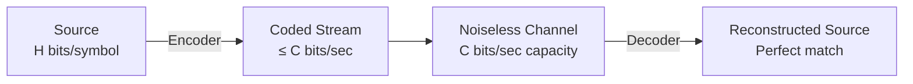

---
tags:
  - information-theory
  - source-coding-theorem
  - fundamental-limit
---

# 9. The Fundamental Theorem for a Noiseless Channel

## Shannon's First Theorem

This is the **Source Coding Theorem** — the first of Shannon's two fundamental theorems. It establishes the precise limit of lossless data compression.

---

## Theorem Statement

Let a source have entropy $H$ (bits per symbol) and a discrete noiseless channel have capacity $C$ (bits per second).

**Part 1 (Achievability):** If $\frac{H}{\tau} \leq C$ (where $\tau$ is the time per source symbol), then there exists a coding system such that the output of the source can be transmitted over the channel with **arbitrarily small delay and error**.

More precisely: for any $\epsilon > 0$ and any $R > H$, there exists a code with average rate $< R$ bits per source symbol that allows perfect reconstruction.

**Part 2 (Converse):** It is impossible to transmit at an average rate $< H$ bits per source symbol with perfect reconstruction.

---

## Intuitive Explanation

The source produces $H$ bits of "new information" per symbol. The channel can carry $C$ bits per second. If the source emits symbols every $\tau$ seconds, it produces $H/\tau$ bits per second of information. As long as this doesn't exceed $C$, the channel can keep up.

The theorem says: **entropy is both necessary and sufficient** for characterizing compressibility.

---

## Proof Sketch (Block Coding)

### Achievability

1. Consider blocks of $N$ source symbols
2. By the AEP (§7), there are $\approx 2^{NH}$ typical blocks, each with probability $\approx 2^{-NH}$
3. Assign each typical block a unique binary code of length $NH + 1$ bits
4. Assign all atypical blocks a shared "overflow" code
5. Expected codeword length per symbol $\to H$ as $N \to \infty$

### Converse

1. Any lossless code must map $n^N$ possible sequences to distinct codewords
2. By the Kraft inequality, the expected length $L$ satisfies $L \geq H$
3. More rigorously: Fano's inequality shows $H(X) \leq L + 1$ for any uniquely decodable code

---

## Corollaries and Implications

### Corollary 1: Compression Limit
No lossless compression algorithm can compress every file. Some files must expand. On average, the best you can do is $H$.

### Corollary 2: Random Data Is Incompressible
If a source is truly random (uniform), $H = \log n$. No compression is possible — and indeed, most "compressed" formats add overhead, expanding such data.

### Corollary 3: Structure Enables Compression
The more structured (lower entropy) a source, the more compressible. English text, with $H \approx 1$ bit/char vs $\log_2 27 \approx 4.75$, is ~80% redundant.

---

## Practical Significance

| Domain | Application |
|--------|-------------|
| File compression | gzip, bzip2, zstd, LZ4 — all approximate this limit |
| Audio compression | FLAC (lossless audio) — approaches Shannon limit for audio |
| Image compression | PNG, lossless WebP — spatial prediction + entropy coding |
| Video compression | Intra-frame coding in lossless modes |
| DNA sequencing | FASTQ compression — specialized entropy coders |

Modern algorithms don't use block coding directly (too slow), but use adaptive methods (arithmetic coding, ANS, asymmetric numeral systems) that achieve the same $H$ limit efficiently.

---

*Next: [§10 — Discussion and Examples](10-discussion-examples.md)*
