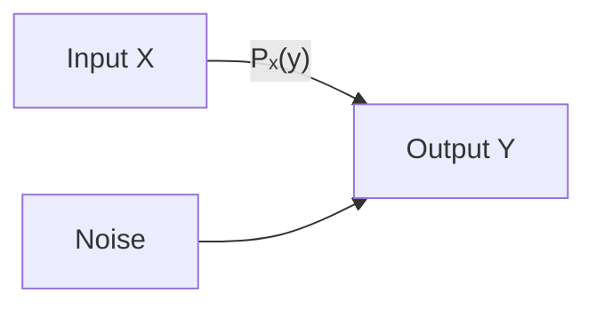
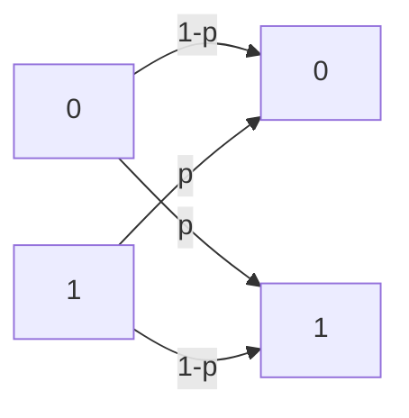

---
tags:
  - information-theory
  - noisy-channel
  - channel-capacity
---

# 11. Representation of a Noisy Discrete Channel

## The Noisy Channel Model

Up to now, channels were noiseless — every symbol arrived exactly as sent. Now we introduce **noise**: the received symbol may differ from the transmitted symbol.

---

## Mathematical Representation

A noisy discrete channel has:
- Input alphabet: $x \in \{x_1, \ldots, x_n\}$
- Output alphabet: $y \in \{y_1, \ldots, y_m\}$
- Transition probabilities: $P_x(y)$ = probability of receiving $y$ when $x$ was sent

For each input $x$, the output probabilities sum to 1:

$$
\sum_y P_x(y) = 1 \quad \text{for all } x
$$

---

## The Binary Symmetric Channel (BSC)

The simplest example: binary input {0, 1}, binary output {0, 1}, with crossover probability $p$:

$$
P_0(0) = 1-p, \quad P_0(1) = p
$$

$$
P_1(1) = 1-p, \quad P_1(0) = p
$$

- If $p = 0$: noiseless channel
- If $p = 0.5$: output is independent of input — channel is useless
- If $p = 1$: always flips — still usable (just invert at receiver)

---

## The Binary Erasure Channel

Another important model: the receiver knows when a symbol was lost:

$$
P_0(0) = 1-\alpha, \quad P_0(\text{?}) = \alpha
$$

$$
P_1(1) = 1-\alpha, \quad P_1(\text{?}) = \alpha
$$

The erasure symbol "?" indicates the receiver knows a symbol was sent but can't determine which. Easier to correct than errors because you know where the problem is.

---

## Equivocation (Conditional Entropy)

The key new quantity for noisy channels is **equivocation** — the remaining uncertainty about the input after observing the output:

$$
\boxed{H_y(x) = -\sum_{x,y} p(x,y) \log p_x(y) = \sum_y p(y) H_y(x)}
$$

Where $H_y(x)$ is the entropy of the input distribution conditioned on the observed output $y$.

**Interpretation:** Even after receiving $y$, we still have $H_y(x)$ bits of uncertainty about what was actually sent.

---

## Mutual Information

The **mutual information** between input and output is:

$$
I(x;y) = H(x) - H_y(x) = H(y) - H_x(y)
$$

This measures how much information about $x$ is conveyed by observing $y$. Properties:
- $I(x;y) \geq 0$
- $I(x;y) = 0$ if and only if $x$ and $y$ are independent
- $I(x;y) \leq \min(H(x), H(y))$

---

## Channel Capacity with Noise

Shannon defines the **capacity of a noisy channel** as:

$$
\boxed{C = \max_{p(x)} I(x;y) = \max_{p(x)} [H(x) - H_y(x)]}
$$

The maximum is over all possible input distributions. This is the highest rate at which reliable information can be transmitted.

For a noiseless channel: $H_y(x) = 0$, so $C = \max H(x) = \log n$.

---

*Next: [§12 — Equivocation and Channel Capacity](12-equivocation-capacity.md)*
