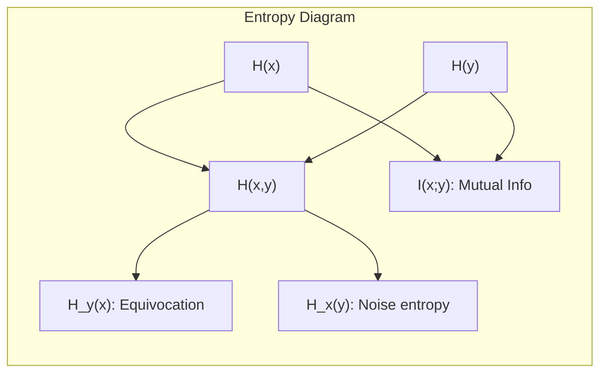

---
tags:
  - information-theory
  - equivocation
  - channel-capacity
---

# 12. Equivocation and Channel Capacity

## Deep Dive into Equivocation

Equivocation $H_y(x)$ is the cornerstone of noisy channel theory. It measures the information "lost" to noise.

---

## Alternative Expressions

Using $p(x,y) = p(x) P_x(y)$:

$$
H_y(x) = -\sum_{x,y} p(x,y) \log \frac{p(x,y)}{p(y)}
$$

$$
= -\sum_{x,y} p(x,y) \log p(x,y) + \sum_y p(y) \log p(y)
$$

$$
= H(x,y) - H(y)
$$

So:

$$
I(x;y) = H(x) + H(y) - H(x,y)
$$

This symmetric form reveals: mutual information is the sum of individual uncertainties minus their joint uncertainty.

---

## The Data Processing Inequality

If $x \to y \to z$ forms a Markov chain (z depends on x only through y):

$$
I(x;z) \leq I(x;y)
$$

**No processing of the output can increase the mutual information.** This is fundamental: you can't create information that wasn't there. Error correction can recover lost information but not exceed the channel's intrinsic capacity.

---

## Computing Capacity

For a general discrete channel, capacity is found by maximizing $I(x;y)$ over the input distribution $p(x)$. This is a convex optimization problem.

### Binary Symmetric Channel

For BSC with crossover $p$:

$$
C = 1 + p \log_2 p + (1-p) \log_2 (1-p) = 1 - H_2(p)
$$

Where $H_2(p)$ is the binary entropy function.

- $p = 0$: $C = 1$ bit/transmission
- $p = 0.5$: $C = 0$ (useless channel)
- $p = 0.11$: $C \approx 0.5$ (roughly where practical codes operate)

### Binary Erasure Channel

For erasure probability $\alpha$:

$$
C = 1 - \alpha
$$

Intuitive: fraction $1-\alpha$ of symbols get through perfectly; the rest are known to be lost. Optimal input: uniform distribution.

---

## Geometric View

- $H(x,y) = H(x) + H_x(y) = H(y) + H_y(x)$
- $I(x;y) = H(x) - H_y(x) = H(y) - H_x(y)$

---

*Next: [§13 — The Fundamental Theorem for a Discrete Channel with Noise](13-fundamental-theorem-noise.md)*
