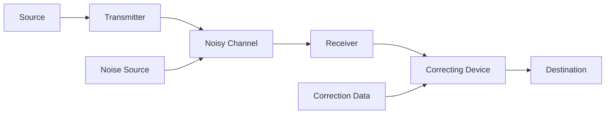
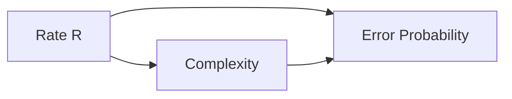

---
tags:
  - information-theory
  - error-correction
  - coding
---

# 14. Discussion

## Interpreting the Noisy Channel Theorem

---

## Equivocation as Correction Cost

The noisy channel theorem says: if $R \u003c C$, we can make errors arbitrarily small. But what if we don't use optimal coding? The **equivocation** $H_y(x)$ has a direct operational meaning:

> $H_y(x)$ is the amount of **additional information** (per second) that must be supplied at the receiving point to correct the received message.

In other words: if you transmit without coding, you'll have $H_y(x)$ bits/second of ambiguity. You could send this extra information over a side channel, or build it into the code.

---

## The Two-Part System

The optimal system splits into:
1. The main channel carrying the coded message
2. A conceptual "correction channel" supplying $H_y(x)$ bits/second

When $R \leq C$, the correction data is zero — the code handles everything.

---

## Practical Error Correction

### Repetition Codes
Send each bit 3 times, majority vote: simple but inefficient. Rate = 1/3.

### Hamming Codes
Add parity bits to detect and correct single-bit errors. First practical error-correcting code (1950).

### Convolutional Codes
Stream-oriented codes with memory. Used in early space missions.

### Modern Codes
- **Turbo codes** (1993): Iterative decoding, near-capacity
- **LDPC codes** (Gallager 1963, rediscovered 1996): Sparse parity check matrices
- **Polar codes** (Arikan 2009): Channel polarization, capacity-achieving with explicit construction

---

## The Trade-off Triangle

For a given channel:
- Higher rate → higher error (if uncoded)
- Lower error → more complexity (longer codes, better algorithms)
- Shannon: you can have any point with $R \u003c C$ and error $\to 0$, but complexity $\to \infty$ as you approach $C$

---

*Next: [§15 — Example of a Discrete Channel and Its Capacity](15-example-channel-capacity.md)*
