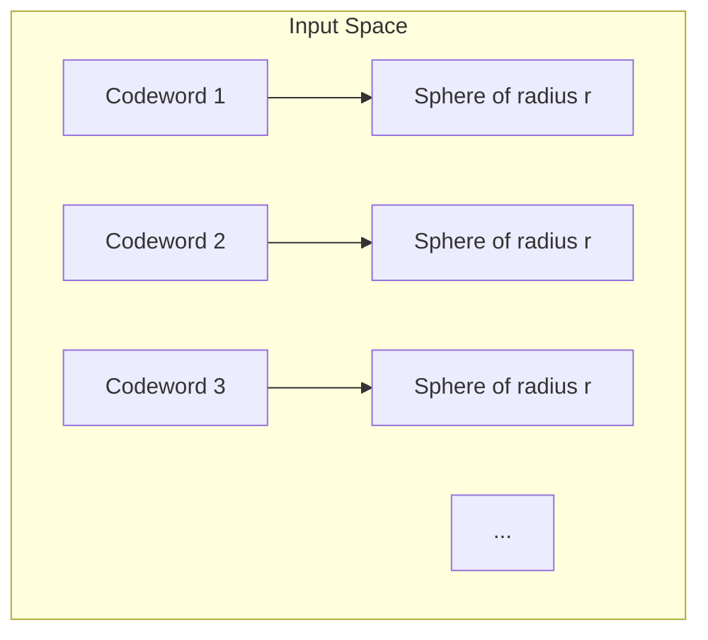

---
tags:
  - information-theory
  - coding
  - examples
---

# 17. An Example of Efficient Coding

## Constructing a Near-Optimal Code

Shannon concludes Part II with an explicit construction showing how to approach capacity. While random coding proves existence, this section gives intuition for structure.

---

## The Construction Idea

For a channel with capacity $C$ and desired rate $R \u003c C$:

1. Choose block length $N$ large enough
2. Select $2^{NR}$ codewords from the typical input set
3. Ensure minimum distance between codewords exceeds a threshold
4. Decode by finding the closest codeword to received sequence

---

## Hamming Distance Decoding

For the BSC: the optimal decoder finds the codeword with minimum **Hamming distance** to the received sequence.

Hamming distance between two binary strings of length $N$:

$$
d(x^N, y^N) = \sum_{i=1}^{N} \mathbb{1}[x_i \neq y_i]
$$

The number of positions where they differ.

---

## Sphere Packing Interpretation

- Each codeword is the center of a "sphere" of typical outputs
- Spheres must not overlap (for unambiguous decoding)
- Total volume of input space limits number of non-overlapping spheres
- Maximum number $\approx 2^{NC}$, giving the capacity limit

---

## Explicit Example: The (7,4) Hamming Code

A perfect single-error-correcting code:
- 4 information bits → 7 transmitted bits
- 3 parity bits detect/correct any single error
- Rate = 4/7 ≈ 0.57
- Corrects all patterns with ≤ 1 error in 7 bits

For BSC with small $p$, this achieves low error at moderate rate. Modern codes (LDPC, Turbo) generalize this idea to much larger blocks.

---

## The Gap Between Theory and Practice in 1948

Shannon's random coding proof showed codes achieving $R \to C$ exist, but:
- Random codes have exponential encoding/decoding complexity
- No constructive method was known
- It took 45 years for turbo codes to approach capacity practically

This gap between "possible" and "practical" drove coding theory for half a century.

---

*End of Part II. Next: [Part III — Mathematical Preliminaries](../part-iii/18-sets-and-ensembles.md)*
