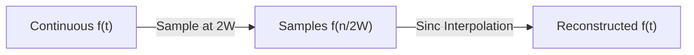

---
tags:
  - information-theory
  - sampling-theorem
  - fourier-analysis
---

# 19. Band Limited Ensembles of Functions

## The Sampling Theorem Foundation

Band-limited functions are central to communication theory because physical channels have finite bandwidth. This section connects Shannon's information theory to his earlier work on the **sampling theorem**.

---

## The Sampling Theorem

A function $f(t)$ with no frequencies above $W$ Hz is completely determined by its samples at rate $2W$ per second:

$$
f(t) = \sum_{n=-\infty}^{\infty} f\left(\frac{n}{2W}\right) \frac{\sin(2\pi W(t - n/2W))}{2\pi W(t - n/2W)}
$$

**Nyquist rate**: $2W$ samples/second is the minimum rate for perfect reconstruction.

---

## Degrees of Freedom

For a time interval $T$ and bandwidth $W$, a band-limited function has:

$$
N = 2WT \quad \text{degrees of freedom}
$$

This is the number of independent values (samples) needed to specify the function on that interval.

The "space" of band-limited functions over duration $T$ is effectively $N$-dimensional.

---

## Entropy Rate of Band-Limited Processes

For a stationary band-limited process with power spectral density $S(f)$:

$$
H = \int_{-W}^{W} \log S(f) \, df
$$

(up to constants and scaling). The entropy rate is proportional to the logarithm of the spectral density integrated over the band.

For white noise with constant spectral density $N_0/2$:

$$
H = 2W \log \frac{N_0}{2}
$$

---

## The Time-Bandwidth Product

The fundamental limit:

$$
\Delta t \cdot \Delta f \geq \frac{1}{4\pi}
$$

(uncertainty principle for Fourier transforms). A signal cannot be simultaneously arbitrarily narrow in both time and frequency.

For information theory: to transmit for time $T$ with bandwidth $W$, you have $\approx 2WT$ independent dimensions to work with.

---

*Next: [§20 — Entropy of a Continuous Distribution](20-entropy-continuous-distribution.md)*
