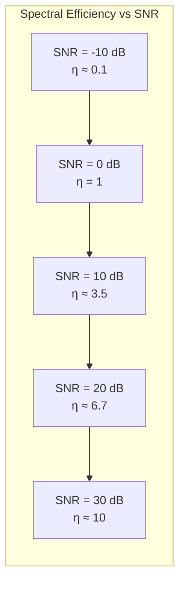

---
tags:
  - information-theory
  - shannon-hartley
  - gaussian-channel
---

# 25. Channel Capacity with an Average Power Limitation

## The Most Famous Formula in Information Theory

For a continuous channel with bandwidth $W$ Hz, additive white Gaussian noise of power $N$, and average signal power limited to $P$:

$$
\boxed{C = W \log_2\left(1 + \frac{P}{N}\right)}
$$

This is the **Shannon–Hartley Law**. It appears in every communications textbook, on Wikipedia, and in the design of every wireless and wired communication system.

---

## Derivation

### Step 1: Degrees of Freedom

A signal band-limited to $W$ for duration $T$ has $N = 2WT$ degrees of freedom (samples).

### Step 2: Power Per Sample

Total signal power $P$ over time $T$ with $2WT$ samples:

$$
\text{Power per sample} = \frac{P}{2W}
$$

Total noise power $N = N_0 W$ over the same band, so noise per sample:

$$
\text{Noise per sample} = \frac{N}{2W} = \frac{N_0}{2}
$$

### Step 3: SNR Per Sample

$$
\text{SNR per sample} = \frac{P/N_0 W}{1/2} = \frac{P}{N}
$$

### Step 4: Capacity Per Sample

For a Gaussian channel with SNR = $P/N$ per sample:

$$
C_{\text{per sample}} = \frac{1}{2}\log_2\left(1 + \frac{P}{N}\right)
$$

### Step 5: Total Capacity

Multiply by $2W$ samples per second:

$$
C = 2W \cdot \frac{1}{2}\log_2\left(1 + \frac{P}{N}\right) = W \log_2\left(1 + \frac{P}{N}\right)
$$

---

## Understanding the Formula

### Bandwidth $W$
More bandwidth → more degrees of freedom per second → linear increase in capacity.

### Power $P$
More power → higher SNR → logarithmic increase in capacity. Doubling power adds 1 bit/Hz (or $W$ bits/second total).

### Noise $N$
Less noise → higher SNR → logarithmic increase. Reducing noise by factor of 2 adds 1 bit/Hz.

### The Logarithm
The diminishing returns: to double capacity, you must quadruple $P/N$ (increase SNR by ~6 dB).

---

## Numerical Examples

| System | Bandwidth | SNR (dB) | Capacity |
|--------|-----------|----------|----------|
| Telephone voice | 3.4 kHz | 30 dB | ~34 kbps |
| WiFi (802.11n) | 40 MHz | 20 dB | ~266 Mbps |
| 4G LTE | 20 MHz | 15 dB | ~100 Mbps |
| Fiber optic | 50 THz | 20 dB | ~50 Tbps (theoretical) |
| Deep space (X-band) | 500 MHz | -5 dB | ~100 Mbps |

---

## Spectral Efficiency

Define **spectral efficiency**:

$$
\eta = \frac{C}{W} = \log_2(1 + \text{SNR}) \quad \text{bits/sec/Hz}
$$

Modern systems approach this limit:
- LTE: ~4–6 bits/sec/Hz
- 5G mmWave: ~8–10 bits/sec/Hz
- Theoretical maximum at 20 dB SNR: ~6.7 bits/sec/Hz

---

## The Waterfall Curve

As SNR increases, spectral efficiency increases logarithmically:

---

## Practical Limits

No real system achieves the full Shannon limit due to:
- Non-Gaussian noise
- Imperfect channel estimation
- Finite block lengths (not $N \to \infty$)
- Implementation complexity
- Peak (not average) power constraints

Modern codes get within 0.5–1.0 dB of the limit.

---

## Historical Impact

Before Shannon, engineers didn't know if there was a fundamental limit. The Shannon–Hartley law:
- Set the theoretical ceiling for all communication systems
- Showed that bandwidth and power are fundamentally tradable
- Proved that error-free transmission is possible even at low SNR (just with low spectral efficiency)
- Justified investments in wider bandwidth (spread spectrum, mmWave, optical) over pure power increases

---

*Next: [§26 — The Channel Capacity with a Peak Power Limitation](26-peak-power-limitation.md)*
