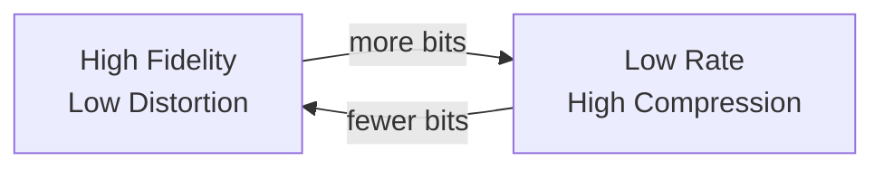

---
tags:
  - information-theory
  - rate-distortion
  - fidelity
---

# 27. Fidelity Evaluation Functions

## Lossy Compression Needs a Distortion Measure

So far, all coding has been **lossless** — perfect reconstruction is required. But many applications (audio, video, images) can tolerate some distortion. The question becomes: how much can we compress if we allow a small amount of loss?

This requires measuring "how close" the reconstructed signal is to the original.

---

## The Fidelity Criterion

A **fidelity evaluation function** $d(x, y)$ measures the distortion between original $x$ and reconstruction $y$.

For discrete symbols: $d(x_i, y_j)$ is a per-symbol distortion.

For continuous functions: $d$ could be integrated over time/space.

---

## Common Distortion Measures

### 1. R.M.S. Criterion (Mean Squared Error)

$$
d(x, y) = \frac{1}{T} \int_0^T (x(t) - y(t))^2 \, dt
$$

Most common in signal processing. Mathematically tractable, corresponds to energy difference.

### 2. Frequency-Weighted R.M.S.

Apply different weights to different frequencies (matching human perception):

$$
d(x, y) = \int_0^W W(f) |X(f) - Y(f)|^2 \, df
$$

Where $W(f)$ emphasizes frequencies the ear is sensitive to. Used in audio coding (MP3, AAC).

### 3. Absolute Error

$$
d(x, y) = \frac{1}{T} \int_0^T |x(t) - y(t)| \, dt
$$

More robust to outliers than squared error. Used in image coding and robust statistics.

### 4. Perceptual Criteria

The ear and brain implicitly define evaluation functions. For example:
- **Masking**: loud sounds hide quieter ones at nearby frequencies
- **Critical bands**: the ear groups frequencies into ~24 bands
- **Temporal masking**: loud sounds mask preceding/following quiet sounds

Modern audio codecs (MP3, AAC, Opus) explicitly model these perceptual criteria.

---

## The Discrete Case as Specialization

The discrete case (Part I–II) implicitly used a **Hamming-like fidelity** criterion:

$$
d(x, y) = \begin{cases} 0 & x = y \\ 1 & x \neq y \end{cases}
$$

Zero distortion for exact match, constant distortion for any error. Rate-distortion with this criterion is equivalent to lossy source coding with symbol error rate constraint.

---

## Fidelity vs. Rate Trade-off

The fundamental question: for a given source and distortion measure, what is the minimum rate needed to achieve distortion $\leq D$?

---

*Next: [§28 — The Rate for a Source Relative to a Fidelity Evaluation](28-rate-relative-to-fidelity.md)*
