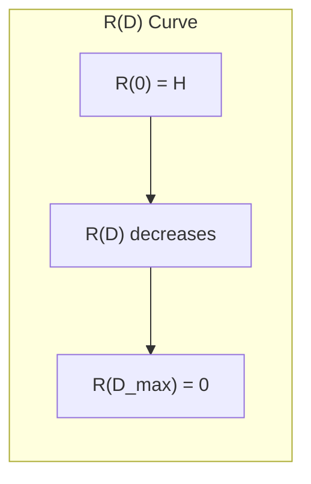

---
tags:
  - information-theory
  - rate-distortion
  - source-coding
---

# 28. The Rate for a Source Relative to a Fidelity Evaluation

## Defining the Rate-Distortion Function

Let $R(D)$ = minimum rate (bits per source symbol) required to represent a source with average distortion $\leq D$.

Formally:

$$
\boxed{R(D) = \min_{p(y|x): \mathbb{E}[d(x,y)] \leq D} I(x; y)}
$$

Minimization over all conditional distributions $p(y|x)$ (test channels) that achieve distortion at most $D$.

---

## Properties of $R(D)$

1. **Monotonically decreasing**: Lower distortion requires higher rate
2. **Convex**: $R(\lambda D_1 + (1-\lambda) D_2) \leq \lambda R(D_1) + (1-\lambda) R(D_2)$
3. **$R(0) = H(x)$**: Lossless rate equals source entropy
4. **$R(D_{\max}) = 0$**: At maximum tolerable distortion, send nothing

---

## The Gaussian Source (Squared Error)

For a Gaussian source with variance $\sigma^2$ and MSE distortion:

$$
R(D) = \begin{cases} \frac{1}{2}\log\frac{\sigma^2}{D} & 0 \leq D \leq \sigma^2 \\ 0 & D > \sigma^2 \end{cases}
$$

**Shannon's reverse water-filling:** For a Gaussian, the rate-distortion function has a closed form. At distortion $D$:

- Allocate $R = \frac{1}{2}\log(\sigma^2/D)$ bits
- Reconstruction error variance = $D$
- The test channel is additive Gaussian noise: $y = x + z$ where $z \sim \mathcal{N}(0, D)$

---

## The Binary Source (Hamming Error)

For a Bernoulli($p$) source with Hamming distortion:

$$
R(D) = H_2(p) - H_2(D)
$$

for $0 \leq D \leq \min(p, 1-p)$.

At $D = 0$: $R(0) = H_2(p)$ (lossless rate).
At $D = p$: $R(p) = 0$ (just guess the more likely symbol).

---

## Operational Meaning

$R(D)$ is both:
1. **Information-theoretic**: minimum mutual information over test channels
2. **Operational**: there exist codes achieving any rate $\u003e R(D)$ with distortion $\leq D$

This is the lossy analog of the source coding theorem.

---

## Application to Modern Compression

| Standard | Source | Distortion | Typical Operating Point |
|----------|--------|------------|------------------------|
| JPEG | Images | DCT-weighted MSE | $R \approx 0.5$–$2$ bpp |
| MP3 | Audio | Perceptual (masking) | $R \approx 128$ kbps |
| H.264/AVC | Video | Motion-compensated MSE | $R \approx 2$–$10$ Mbps |
| JPEG 2000 | Images | Wavelet MSE | $R \approx 0.25$–$4$ bpp |

None achieve the theoretical $R(D)$ exactly, but modern codecs get within 1–3 dB (in rate) of optimal.

---

*Next: [§29 — The Calculation of Rates](29-calculation-of-rates.md)*
