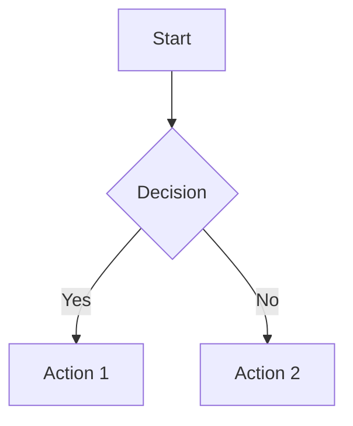

# Migrating from MkDocs

This guide walks you through migrating an existing [MkDocs](https://www.mkdocs.org/) project to DocsForge. Whether you're using MkDocs with the Material theme or a custom setup, the migration is straightforward and brings significant benefits.

---

## Why Migrate?

### Bundled Dependencies

DocsForge ships with all dependencies pre-bundled. You don't need to manage:

- `mkdocs-material` (and its 20+ dependencies)
- Python environment for MkDocs
- Node.js for build tooling
- KaTeX, Mermaid, or other JS libraries

!!! tip "Zero Installation"
    Just install the `docsforge` CLI tool and you're ready to build. No `pip install`, no `npm install`, no dependency conflicts.

### Zero Configuration

DocsForge works out of the box with sensible defaults. Many projects need **no configuration file at all** — just run `docsforge build` in a directory with Markdown files.

When you do need configuration, `docsforge.yml` is simpler and more focused than `mkdocs.yml`.

### Same Theme Quality

DocsForge uses the same visual foundation as MkDocs Material (the most popular MkDocs theme). You get:

- Responsive design
- Dark/light mode toggle
- Navigation sidebar and search
- Code syntax highlighting
- Admonitions (callout boxes)
- Tables of contents

!!! note "Material Theme Built-In"
    The Material theme is built into DocsForge. No separate installation or theme declaration needed.

---

## Migration Command

### Automatic Migration (Recommended)

DocsForge provides a migration command to convert your existing MkDocs project:

```bash
docsforge migrate
```

This command will:

1. Detect `mkdocs.yml` in the current directory
2. Convert it to `docsforge.yml`
3. Map plugins and extensions to their built-in equivalents
4. Remove redundant asset declarations (KaTeX, fonts, icons)
5. Report any items that need manual review

!!! warning "Backup First"
    Always commit your current state to version control before running `docsforge migrate`:
    ```bash
    git add -A
    git commit -m "backup before docsforge migration"
    ```

### Manual Migration

If the automatic migration isn't available or you prefer full control, follow the manual steps below. The rest of this guide covers each aspect in detail.

---

## Configuration File Changes

### File Rename

The simplest change: rename your configuration file:

```bash
mv mkdocs.yml docsforge.yml
```

### Key Differences

| Feature | MkDocs (`mkdocs.yml`) | DocsForge (`docsforge.yml`) |
|---------|----------------------|---------------------------|
| Theme declaration | `theme: name: material` | **Not needed** — built-in |
| Theme customization | `theme: palette`, `features`, etc. | Top-level keys like `palette`, `features` |
| Extra CSS/JS | `extra_css:`, `extra_javascript:` | **Remove** — assets are vendored |
| Plugins | `plugins:` list | **Remove built-ins** — keep only custom ones |
| Markdown extensions | `markdown_extensions:` list | **Remove built-ins** — keep only custom ones |
| Extra variables | `extra:` | `extra:` (same syntax) |
| Site metadata | `site_name`, `site_url`, `site_description` | Same keys, same meaning |

### Example: Minimal Config

**MkDocs (`mkdocs.yml`):**
```yaml
site_name: My Documentation
site_url: https://example.com/docs

theme:
  name: material
  palette:
    - scheme: default
      primary: indigo
      accent: indigo
      toggle:
        icon: material/brightness-7
        name: Switch to dark mode
    - scheme: slate
      primary: indigo
      accent: indigo
      toggle:
        icon: material/brightness-4
        name: Switch to light mode

plugins:
  - search
  - minify
  - with-pdf

markdown_extensions:
  - admonition
  - pymdownx.details
  - pymdownx.superfences
  - pymdownx.highlight:
      anchor_linenums: true
  - pymdownx.inlinehilite
  - pymdownx.snippets
  - pymdownx.tabbed:
      alternate_style: true
  - pymdownx.arithmatex:
      generic: true

extra_javascript:
  - javascripts/mathjax.js
  - https://polyfill.io/v3/polyfill.min.js?features=es6
  - https://cdn.jsdelivr.net/npm/mathjax@3/es5/tex-mml-chtml.js

extra_css:
  - stylesheets/extra.css
```

**DocsForge (`docsforge.yml`):**
```yaml
site_name: My Documentation
site_url: https://example.com/docs

# Theme is built-in, no "theme:" section needed
palette:
  - scheme: default
    primary: indigo
    accent: indigo
    toggle:
      icon: material/brightness-7
      name: Switch to dark mode
  - scheme: slate
    primary: indigo
    accent: indigo
    toggle:
      icon: material/brightness-4
      name: Switch to light mode

# No plugins section needed for built-ins
# Add only custom plugins here:
# plugins:
#   - with-pdf

# No markdown_extensions section needed for built-ins
# Add only custom extensions here:
# markdown_extensions:
#   - my_custom_extension

# Remove extra_javascript and extra_css for vendored assets
# Keep only your truly custom styles:
# extra_css:
#   - stylesheets/extra.css
```

!!! tip "Simpler is Better"
    Start with no config file at all. Run `docsforge build` and see what works. Add configuration only for things that need customization.

---

## Plugin Migration

### Built-In Plugins (Remove from Config)

These MkDocs plugins are **built into DocsForge** and should be removed from your configuration:

| MkDocs Plugin | DocsForge Status | Notes |
|--------------|------------------|-------|
| `search` | ✅ Built-in | Full-text search with no config needed |
| `minify` | ✅ Built-in | HTML/CSS/JS minification always enabled in production |
| `offline` | ✅ Built-in | Service worker generated automatically |
| `social` | ✅ Built-in | Social cards generated during build |
| `tags` | ✅ Built-in | Tag support enabled by default |
| `blog` | ✅ Built-in | Blog plugin available |
| `i18n` | ✅ Built-in | Internationalization support |

### Plugins to Remove from `mkdocs.yml`

```yaml
# REMOVE these from your mkdocs.yml before migration:
plugins:
  - search          # Built-in
  - minify          # Built-in
  - tags            # Built-in
  # Keep only non-built-in plugins:
  # - with-pdf
  # - your-custom-plugin
```

### Custom Plugins

If you use custom MkDocs plugins, check if DocsForge has a native equivalent:

| Custom Plugin | DocsForge Alternative |
|--------------|------------------------|
| `mkdocs-with-pdf` | Use `docsforge export pdf` |
| `mkdocs-exclude` | Use `exclude:` in `docsforge.yml` |
| `mkdocs-redirects` | Use `redirects:` in `docsforge.yml` |
| `mkdocs-git-revision-date` | Use `{{ git_revision_date }}` in templates |

!!! warning "Plugin Compatibility"
    MkDocs plugins are **not compatible** with DocsForge. Custom plugins must be rewritten using the DocsForge plugin API. Contact the plugin author or check the DocsForge plugin registry for alternatives.

---

## Extension Migration

### Built-In Extensions (Remove from Config)

These Markdown extensions are **enabled by default** in DocsForge:

| Extension | MkDocs Name | DocsForge Status |
|-----------|-------------|------------------|
| Admonitions | `admonition` | ✅ Built-in |
| Code fences | `codehilite` or `pymdownx.highlight` | ✅ Built-in (with line numbers) |
| Inline code highlighting | `pymdownx.inlinehilite` | ✅ Built-in |
| Tables | `tables` | ✅ Built-in |
| Meta blocks | `meta` | ✅ Built-in |
| Table of contents | `toc` | ✅ Built-in (with permalink support) |
| Details/summary | `pymdownx.details` | ✅ Built-in |
| Superfences | `pymdownx.superfences` | ✅ Built-in |
| Task lists | `pymdownx.tasklist` | ✅ Built-in |
| Snippets | `pymdownx.snippets` | ✅ Built-in |
| Tabbed content | `pymdownx.tabbed` | ✅ Built-in |
| Emoji | `pymdownx.emoji` | ✅ Built-in (with Material icon set) |
| Arithmatex | `pymdownx.arithmatex` | ✅ Built-in (using KaTeX) |
| Mermaid diagrams | `pymdownx.superfences` + custom fence | ✅ Built-in (Mermaid supported) |
| Keys | `pymdownx.keys` | ✅ Built-in |
| Mark | `pymdownx.mark` | ✅ Built-in |
| Critic | `pymdownx.critic` | ✅ Built-in |
| Caret | `pymdownx.caret` | ✅ Built-in |
| Tilde | `pymdownx.tilde` | ✅ Built-in |

### Extensions to Remove

```yaml
# REMOVE these from your markdown_extensions:
markdown_extensions:
  - admonition                    # Built-in
  - pymdownx.details              # Built-in
  - pymdownx.superfences          # Built-in
  - pymdownx.highlight            # Built-in
  - pymdownx.inlinehilite         # Built-in
  - pymdownx.snippets             # Built-in
  - pymdownx.tabbed               # Built-in
  - pymdownx.arithmatex:          # Built-in
      generic: true
  - tables                        # Built-in
  - toc:                          # Built-in
      permalink: true
  # Keep only truly custom extensions
```

!!! tip "Configuration-Free Markdown"
    DocsForge's Markdown processing is designed to "just work" with the features most documentation needs. The default setup covers ~90% of common use cases without any configuration.

---

## Theme Migration

### No Theme Installation Required

In MkDocs, you install the Material theme separately:

```bash
# MkDocs — required steps
pip install mkdocs-material
# Then in mkdocs.yml:
# theme:
#   name: material
```

In DocsForge, the Material theme is **built-in and always available**:

```yaml
# docsforge.yml — NO theme section needed
# The theme is automatic
```

### Theme Customization Migration

MkDocs Material theme options map to top-level DocsForge keys:

| MkDocs Path | DocsForge Path |
|-------------|----------------|
| `theme.palette` | `palette` |
| `theme.features` | `features` |
| `theme.icon` | `icon` |
| `theme.logo` | `logo` |
| `theme.favicon` | `favicon` |
| `theme.font` | **Remove** — fonts are vendored |
| `theme.language` | `language` |
| `theme.custom_dir` | `custom_dir` |

**Example:**

```yaml
# MkDocs
# theme:
#   name: material
#   palette:
#     scheme: slate
#   features:
#     - navigation.tabs
#   logo: assets/logo.png

# DocsForge
palette:
  scheme: slate

features:
  - navigation.tabs

logo: assets/logo.png
```

---

## Asset Migration

### Vendored Assets (Remove from Config)

DocsForge bundles common assets so you don't need to declare them:

| Asset | MkDocs Approach | DocsForge Approach |
|-------|-----------------|-------------------|
| KaTeX (math rendering) | `extra_javascript` + `extra_css` | **Remove** — built-in |
| Mermaid (diagrams) | `extra_javascript` | **Remove** — built-in |
| Material Icons | `extra_css` or theme font | **Remove** — built-in |
| Google Fonts | `theme.font` | **Remove** — vendored fonts |
| Pygments styles | `extra_css` or theme palette | **Remove** — automatic |
| JavaScript polyfills | `extra_javascript` | **Remove** — not needed |

### Remove These Declarations

```yaml
# REMOVE from mkdocs.yml — all are vendored in DocsForge

extra_javascript:
  - javascripts/katex.js          # Remove
  - javascripts/mermaid.js        # Remove
  - https://cdn.jsdelivr.net/npm/katex@0.16.9/dist/katex.min.js  # Remove
  - https://cdn.jsdelivr.net/npm/mermaid@10/dist/mermaid.min.js  # Remove

extra_css:
  - stylesheets/katex.css          # Remove
  - https://cdn.jsdelivr.net/npm/katex@0.16.9/dist/katex.min.css # Remove
  - stylesheets/extra.css          # Keep only if truly custom
```

### Custom Assets (Keep)

If you have truly custom CSS or JavaScript (not for vendored libraries), keep them:

```yaml
# docsforge.yml
extra_css:
  - stylesheets/custom-branding.css
  - stylesheets/custom-layout.css

extra_javascript:
  - javascripts/analytics.js
  - javascripts/custom-interactions.js
```

!!! warning "Don't Forget to Remove CDN Links"
    CDN links in `extra_javascript` and `extra_css` are the most common leftover from MkDocs migration. They add unnecessary network requests and can cause conflicts with vendored versions.

---

## Common Issues During Migration

### CSS Changes

**Issue:** Custom CSS that targeted MkDocs-specific class names doesn't work.

**Solution:** DocsForge uses similar but not identical CSS classes. Update your selectors:

```css
/* MkDocs Material */
.md-header__inner { ... }
.md-nav__title { ... }

/* DocsForge */
.df-header__inner { ... }
.df-nav__title { ... }

/* Or use more stable selectors */
[data-md-component="header"] { ... }
[data-md-component="navigation"] { ... }
```

!!! tip "Inspect the DOM"
    Use browser dev tools to inspect the generated HTML and find the correct class names. The structure is similar to MkDocs Material but may use `df-` prefixed classes.

### Plugin Differences

**Issue:** A plugin that worked in MkDocs behaves differently or is missing.

**Solution:**

1. Check if the feature is built-in (search, tags, minify, etc.)
2. Check the DocsForge plugin registry for alternatives
3. Remove the plugin from config if it's now built-in
4. For custom plugins, contact the author about DocsForge support

### Path Issues

**Issue:** Links or image paths break after migration.

**Solution:** DocsForge uses the same path resolution as MkDocs for `docs/` content. Common fixes:

```markdown
<!-- MkDocs — sometimes worked with relative paths -->


<!-- DocsForge — always use absolute paths from docs root -->

```

### Math Rendering (KaTeX)

**Issue:** Math formulas don't render.

**Solution:** KaTeX is built-in. Remove all KaTeX-related scripts and styles from your config. Use standard syntax:

```markdown
Inline: $E = mc^2$

Block:
$$
\sum_{i=1}^n x_i = x_1 + x_2 + \cdots + x_n
$$
```

No configuration needed. No `extra_javascript`. No `extra_css`. It just works.

### Diagram Rendering (Mermaid)

**Issue:** Mermaid diagrams don't render.

**Solution:** Mermaid is built-in. Remove Mermaid JS declarations from your config. Use fenced code blocks:

````markdown

````

No `extra_javascript`. No `extra_css`. Built-in.

### Search Index Differences

**Issue:** Search behaves differently (ranking, highlighting, etc.).

**Solution:** DocsForge uses a built-in search engine. It supports:

- Full-text search
- Stemming and tokenization
- Query highlighting
- Search suggestions

If you need custom search behavior, check the `search:` configuration section in `docsforge.yml`.

### Build Output Differences

**Issue:** The built site has different file structure or URLs.

**Solution:** DocsForge generates the same URL structure as MkDocs (`/page/` for directories, `page.md` → `page/index.html`). If you see differences:

1. Check `use_directory_urls` setting (defaults to `true` in both)
2. Verify `site_url` is set correctly for canonical URLs
3. Check `nav` structure matches your intended hierarchy

---

## Before/After Config Comparison

### Complete Real-World Example

Here's a realistic `mkdocs.yml` from a project using Material theme with common plugins and extensions, and its DocsForge equivalent.

**Before: `mkdocs.yml` (MkDocs)**

```yaml
site_name: Cloud Platform Docs
site_url: https://docs.cloudplatform.example.com
site_description: Documentation for the Cloud Platform
site_author: Platform Team

copyright: Copyright &copy; 2024 Platform Team

repo_url: https://github.com/cloudplatform/docs
repo_name: cloudplatform/docs
edit_uri: edit/main/docs/

theme:
  name: material
  palette:
    - media: "(prefers-color-scheme: light)"
      scheme: default
      primary: blue
      accent: blue
      toggle:
        icon: material/brightness-7
        name: Switch to dark mode
    - media: "(prefers-color-scheme: dark)"
      scheme: slate
      primary: blue
      accent: blue
      toggle:
        icon: material/brightness-4
        name: Switch to light mode
  features:
    - navigation.tabs
    - navigation.sections
    - navigation.expand
    - navigation.path
    - navigation.top
    - search.suggest
    - search.highlight
    - content.tabs.link
    - content.code.copy
    - content.action.edit
  icon:
    repo: fontawesome/brands/github
  logo: assets/logo.svg
  favicon: assets/favicon.png
  font:
    text: Roboto
    code: Roboto Mono

plugins:
  - search:
      separator: '[\s\-,:!=\[\]()"/]+|\.(?!\d)|&[lg]t;|(?<!\d)[:=\-]|\$'
  - minify:
      minify_html: true
  - tags:
      tags_file: tags.md
  - blog:
      blog_dir: blog
      blog_toc: true
  - redirects:
      redirect_maps:
        old-page.md: new-page.md

markdown_extensions:
  - admonition
  - pymdownx.details
  - pymdownx.superfences
  - pymdownx.highlight:
      anchor_linenums: true
      line_spans: __span
      pygments_lang_class: true
  - pymdownx.inlinehilite
  - pymdownx.snippets:
      auto_append:
        - includes/abbreviations.md
  - pymdownx.tabbed:
      alternate_style: true
  - pymdownx.tasklist:
      custom_checkbox: true
  - pymdownx.emoji:
      emoji_index: !!python/name:materialx.emoji.twemoji
      emoji_generator: !!python/name:materialx.emoji.to_svg
  - pymdownx.arithmatex:
      generic: true
  - def_list
  - pymdownx.critic
  - pymdownx.caret
  - pymdownx.keys
  - pymdownx.mark
  - pymdownx.tilde
  - tables
  - toc:
      permalink: true
      title: On this page

extra_javascript:
  - javascripts/katex.js
  - https://cdnjs.cloudflare.com/ajax/libs/KaTeX/0.16.9/katex.min.js
  - https://cdnjs.cloudflare.com/ajax/libs/KaTeX/0.16.9/contrib/auto-render.min.js

extra_css:
  - https://cdnjs.cloudflare.com/ajax/libs/KaTeX/0.16.9/katex.min.css
  - stylesheets/custom.css

extra:
  social:
    - icon: fontawesome/brands/github
      link: https://github.com/cloudplatform
    - icon: fontawesome/brands/twitter
      link: https://twitter.com/cloudplatform
  version:
    provider: mike
  analytics:
    provider: google
    property: G-XXXXXXXXXX

nav:
  - Home: index.md
  - Getting Started:
    - Installation: getting-started/installation.md
    - Configuration: getting-started/configuration.md
  - Reference:
    - API: reference/api.md
    - CLI: reference/cli.md
  - Blog: blog/
```

**After: `docsforge.yml` (DocsForge)**

```yaml
site_name: Cloud Platform Docs
site_url: https://docs.cloudplatform.example.com
site_description: Documentation for the Cloud Platform
site_author: Platform Team

copyright: Copyright &copy; 2024 Platform Team

repo_url: https://github.com/cloudplatform/docs
repo_name: cloudplatform/docs
edit_uri: edit/main/docs/

# Theme is built-in — no "theme:" section
palette:
  - media: "(prefers-color-scheme: light)"
    scheme: default
    primary: blue
    accent: blue
    toggle:
      icon: material/brightness-7
      name: Switch to dark mode
  - media: "(prefers-color-scheme: dark)"
    scheme: slate
    primary: blue
    accent: blue
    toggle:
      icon: material/brightness-4
      name: Switch to light mode

features:
  - navigation.tabs
  - navigation.sections
  - navigation.expand
  - navigation.path
  - navigation.top
  - search.suggest
  - search.highlight
  - content.tabs.link
  - content.code.copy
  - content.action.edit

icon:
  repo: fontawesome/brands/github

logo: assets/logo.svg
favicon: assets/favicon.png

# Font is vendored — no "font:" section needed

# Search is built-in — no "plugins: search" needed
# Minify is built-in — no "plugins: minify" needed
# Tags are built-in — no "plugins: tags" needed
# Blog is built-in — no "plugins: blog" needed
# Keep only non-built-in plugins:
plugins:
  redirects:
    redirect_maps:
      old-page.md: new-page.md

# Extensions are built-in — remove all standard ones
# Keep only custom/non-standard extensions if any

# KaTeX is vendored — remove all KaTeX assets
extra_css:
  - stylesheets/custom.css

extra:
  social:
    - icon: fontawesome/brands/github
      link: https://github.com/cloudplatform
    - icon: fontawesome/brands/twitter
      link: https://twitter.com/cloudplatform
  version:
    provider: mike
  analytics:
    provider: google
    property: G-XXXXXXXXXX

nav:
  - Home: index.md
  - Getting Started:
    - Installation: getting-started/installation.md
    - Configuration: getting-started/configuration.md
  - Reference:
    - API: reference/api.md
    - CLI: reference/cli.md
  - Blog: blog/
```

!!! note "What Changed?"
    - Removed `theme:` wrapper — all theme keys are top-level
    - Removed `font:` — fonts are vendored
    - Removed `plugins: search, minify, tags, blog` — built-in
    - Removed entire `markdown_extensions:` section — built-in
    - Removed `extra_javascript` and KaTeX `extra_css` — vendored
    - Kept `redirects` plugin — not built-in
    - Kept `custom.css` — truly custom styling
    - Kept `nav`, `extra`, `site_*` — same syntax

---

## Step-by-Step Migration Checklist

### Pre-Migration

- [ ] Commit all changes to version control
- [ ] Run `mkdocs build` to verify current site builds correctly
- [ ] Note any custom plugins or extensions that might not have equivalents
- [ ] List all `extra_javascript` and `extra_css` entries
- [ ] Identify which entries are for KaTeX, Mermaid, fonts, or other vendored assets
- [ ] Back up `mkdocs.yml` (it will be rewritten as `docsforge.yml`)

### Migration (Automatic)

- [ ] Install DocsForge: `npm install -g @docsforge/cli` (or equivalent)
- [ ] Run `docsforge migrate` in your project directory
- [ ] Review the migration report for warnings or manual steps needed
- [ ] Check the generated `docsforge.yml` for correctness

### Migration (Manual)

- [ ] Rename `mkdocs.yml` → `docsforge.yml`
- [ ] Remove `theme:` wrapper, promote all keys to top-level
- [ ] Remove `theme.name` and `theme.font` entries
- [ ] Remove `plugins:` entries for built-in plugins (search, minify, tags, blog)
- [ ] Remove `markdown_extensions:` section entirely (or keep only custom ones)
- [ ] Remove `extra_javascript:` entries for KaTeX, Mermaid, polyfills
- [ ] Remove `extra_css:` entries for KaTeX, fonts, external libraries
- [ ] Keep only truly custom `extra_css` and `extra_javascript` entries
- [ ] Verify `nav:` structure is unchanged
- [ ] Verify `extra:` variables are unchanged
- [ ] Verify `site_*` metadata keys are unchanged

### Post-Migration

- [ ] Run `docsforge build` to test the build
- [ ] Compare built output with previous MkDocs build
- [ ] Check all pages render correctly
- [ ] Verify search works
- [ ] Verify dark/light mode toggle works
- [ ] Verify code highlighting works
- [ ] Verify admonitions render correctly
- [ ] Verify Mermaid diagrams render (if used)
- [ ] Verify math formulas render (if used)
- [ ] Verify custom CSS still applies correctly (update selectors if needed)
- [ ] Test all internal links
- [ ] Test all external links in `extra.social` or nav
- [ ] Run `docsforge serve` and do a visual review
- [ ] Commit the migrated configuration
- [ ] Update CI/CD pipelines to use `docsforge build` instead of `mkdocs build`
- [ ] Update documentation for contributors about the new build tool
- [ ] Remove `mkdocs.yml` from version control (after confirming migration works)
- [ ] Remove `requirements.txt` or `Pipfile` entries for MkDocs and plugins (if no longer needed for other projects)

!!! tip "Gradual Migration"
    You can run both MkDocs and DocsForge in parallel during transition. Keep `mkdocs.yml` as a backup while you validate the DocsForge build. Once satisfied, remove the MkDocs config and dependencies.

---

## Troubleshooting

### Build Failures

**Error:** `Unknown configuration key: theme.name`

**Fix:** Remove the `theme:` wrapper. In DocsForge, theme keys are top-level.

```yaml
# Wrong
theme:
  name: material
  palette:
    - scheme: default

# Right
palette:
  - scheme: default
```

---

**Error:** `Plugin 'search' not found`

**Fix:** Remove the `plugins:` section entirely, or remove `search` from it. Search is built-in.

---

**Error:** `Extension 'pymdownx.highlight' not found`

**Fix:** Remove the `markdown_extensions:` section entirely. All common extensions are built-in.

---

### Visual Differences

**Issue:** Site looks different from MkDocs build.

**Diagnosis:**
1. Check if custom CSS selectors need updating (class names may differ)
2. Verify no CDN assets are conflicting with vendored versions
3. Check if `palette` or `features` settings match your MkDocs theme config

---

**Issue:** Icons missing or wrong.

**Fix:** DocsForge uses the same Material icon set. Check that icon names in `extra.social` or content use the correct format: `material/brightness-7` or `fontawesome/brands/github`.

---

## Getting Help

If you encounter issues not covered in this guide:

1. Check the [DocsForge documentation](https://docsforge.com/docs/)
2. Search existing [GitHub issues](https://github.com/docsforge/docsforge/issues)
3. Join the [Discord community](https://discord.gg/docsforge)
4. Open a new issue with:
   - Your original `mkdocs.yml`
   - Your current `docsforge.yml`
   - The error message or unexpected behavior
   - DocsForge version (`docsforge --version`)

---

## Next Steps

After migration, explore DocsForge features that go beyond MkDocs:

- **Faster builds:** Incremental builds and hot reload
- **Built-in preview:** `docsforge serve` with live reload
- **TypeScript support:** Write plugins in TypeScript
- **Modern toolchain:** Built on Vite for fast development
- **Integrated hosting:** Deploy with `docsforge deploy`

Welcome to DocsForge! 🚀
