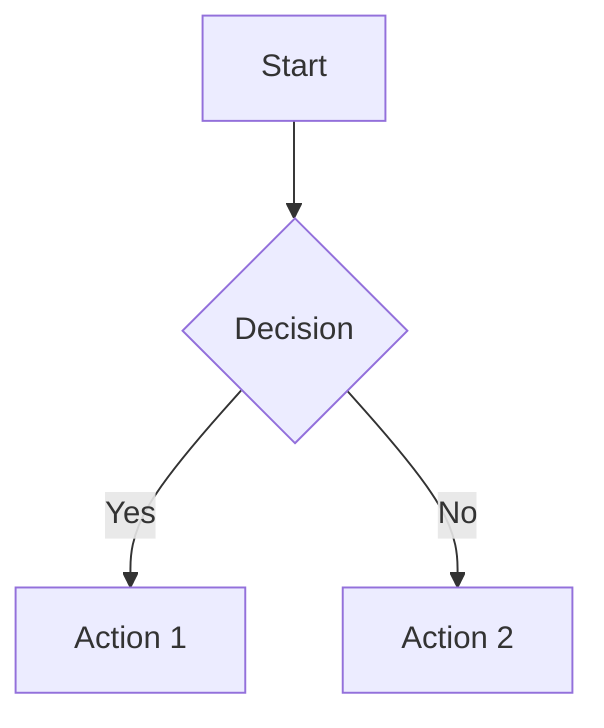

# 从 MkDocs 迁移

本指南将带你把现有的 [MkDocs](https://www.mkdocs.org/) 项目迁移到 DocsForge。无论你使用的是 MkDocs Material 主题还是自定义配置，迁移过程都很简单，并能带来显著收益。

---

## 为什么要迁移？

### 依赖已内置

DocsForge 预置了所有依赖，无需额外管理：

- `mkdocs-material`（及其 20 多个依赖）
- MkDocs 的 Python 环境
- 构建工具的 Node.js
- KaTeX、Mermaid 等 JS 库

!!! tip "零安装"
    只需安装 `docsforge` CLI 工具即可开始构建。无需 `pip install`，无需 `npm install`，也没有依赖冲突。

### 零配置

DocsForge 开箱即用，具有合理的默认设置。许多项目**根本不需要配置文件**——只需在包含 Markdown 文件的目录中运行 `docsforge build`。

当你确实需要配置时，`docsforge.yml` 比 `mkdocs.yml` 更简单、更聚焦。

### 同样的主题品质

DocsForge 使用了与 MkDocs Material（最受欢迎的 MkDocs 主题）相同的视觉基础。你可以获得：

- 响应式设计
- 深色/浅色模式切换
- 导航侧边栏和搜索
- 代码语法高亮
- 提示框（admonitions）
- 目录

!!! note "Material 主题已内置"
    Material 主题已内置在 DocsForge 中，无需单独安装或声明主题。

---

## 迁移命令

### 手动迁移

DocsForge 目前尚未提供自动迁移命令。请按照以下步骤手动转换项目。本指南的其余部分将详细介绍每个方面。

!!! warning "先备份"
    迁移前务必将当前状态提交到版本控制：
    ```bash
    git add -A
    git commit -m "backup before docsforge migration"
    ```

---

## 配置文件变更

### 文件重命名

最简单的变更：重命名你的配置文件：

```bash
mv mkdocs.yml docsforge.yml
```

### 关键差异

| 特性 | MkDocs (`mkdocs.yml`) | DocsForge (`docsforge.yml`) |
|---------|----------------------|---------------------------|
| 主题声明 | `theme: name: material` | **无需设置** — 已内置 |
| 主题自定义 | `theme: palette`、`features` 等 | `theme.palette`、`theme.features` 等 |
| 额外 CSS/JS | `extra_css:`、`extra_javascript:` | **移除** — 资源已内置 |
| 插件 | `plugins:` 列表 | **移除内置插件** — 仅保留自定义插件 |
| Markdown 扩展 | `markdown_extensions:` 列表 | **移除内置扩展** — 仅保留自定义扩展 |
| 额外变量 | `extra:` | `extra:`（语法相同） |
| 站点元数据 | `site_name`、`site_url`、`site_description` | 相同键名，相同含义 |

### 示例：最小化配置

**MkDocs (`mkdocs.yml`)：**
```yaml
site_name: My Documentation
site_url: https://example.com/docs

theme:
  name: material
  palette:
    - scheme: default
      primary: indigo
      accent: indigo
      toggle:
        icon: material/brightness-7
        name: Switch to dark mode
    - scheme: slate
      primary: indigo
      accent: indigo
      toggle:
        icon: material/brightness-4
        name: Switch to light mode

plugins:
  - search
  - minify
  - with-pdf

markdown_extensions:
  - admonition
  - pymdownx.details
  - pymdownx.superfences
  - pymdownx.highlight:
      anchor_linenums: true
  - pymdownx.inlinehilite
  - pymdownx.snippets
  - pymdownx.tabbed:
      alternate_style: true
  - pymdownx.arithmatex:
      generic: true

extra_javascript:
  - javascripts/mathjax.js
  - https://polyfill.io/v3/polyfill.min.js?features=es6
  - https://cdn.jsdelivr.net/npm/mathjax@3/es5/tex-mml-chtml.js

extra_css:
  - stylesheets/extra.css
```

**DocsForge (`docsforge.yml`)：**
```yaml
site_name: My Documentation
site_url: https://example.com/docs

# 主题已内置 — 使用 "theme: name: material"
theme:
  name: material
  palette:
    - scheme: default
      primary: indigo
      accent: indigo
      toggle:
        icon: material/brightness-7
        name: Switch to dark mode
    - scheme: slate
      primary: indigo
      accent: indigo
      toggle:
        icon: material/brightness-4
        name: Switch to light mode

# 内置插件无需 plugins 段
# 仅在此处添加自定义插件：
# plugins:
#   - your-custom-plugin

# 内置扩展无需 markdown_extensions 段
# 仅在此处添加自定义扩展：
# markdown_extensions:
#   - my_custom_extension

# 对于自带资源，移除 extra_javascript 和 extra_css
# 仅保留真正自定义的样式：
# extra_css:
#   - stylesheets/extra.css
```

!!! tip "越简单越好"
    开始时先不要配置文件。运行 `docsforge build`，看看哪些功能已经可用。只在真正需要自定义的地方添加配置。

---

## 插件迁移

### 内置插件（从配置中移除）

以下 MkDocs 插件已**内置到 DocsForge** 中，应从配置中移除：

| MkDocs 插件 | DocsForge 状态 | 说明 |
|--------------|------------------|-------|
| `search` | :material-check-bold: 已内置 | 无需配置的全文搜索 |
| `minify` | :material-check-bold: 已内置 | 生产环境始终启用 HTML/CSS/JS 压缩 |
| `offline` | :material-check-bold: 已内置 | 自动生成 Service Worker |
| `tags` | :material-check-bold: 已内置 | 默认启用标签支持 |
| `blog` | :material-check-bold: 已内置 | 博客插件可用 |
| `social` | ❌ 未内置 | 需要 Pillow + CairoSVG；如需请使用自定义图片 |
| `i18n` | ❌ 未内置 | 多语言支持尚未提供 |

### 需要从 `mkdocs.yml` 中移除的插件

```yaml
# 迁移前，从 mkdocs.yml 中移除以下项：
plugins:
  - search          # 内置
  - minify          # 内置
  - tags            # 内置
  # 仅保留非内置插件：
  # - with-pdf
  # - your-custom-plugin
```

### 自定义插件

如果你使用了自定义 MkDocs 插件，请检查 DocsForge 是否有原生替代方案：

| 自定义插件 | DocsForge 替代方案 |
|--------------|------------------------|
| `mkdocs-with-pdf` | 不可用；请使用外部 PDF 生成器 |
| `mkdocs-exclude` | 在 `docsforge.yml` 中使用 `exclude_docs:` |
| `mkdocs-redirects` | 非内置；需要自定义插件 |
| `mkdocs-git-revision-date` | 模板中会自动填充 Git 日期 |

!!! warning "插件兼容性"
    MkDocs 插件与 DocsForge **不兼容**。自定义插件必须使用 DocsForge 插件 API 重写。请联系插件作者，或在 DocsForge 插件注册表中查找替代方案。

---

## 扩展迁移

### 内置扩展（从配置中移除）

以下 Markdown 扩展在 DocsForge 中**默认启用**：

| 扩展 | MkDocs 名称 | DocsForge 状态 |
|-----------|-------------|------------------|
| 提示框 | `admonition` | :material-check-bold: 已内置 |
| 代码围栏 | `codehilite` 或 `pymdownx.highlight` | :material-check-bold: 已内置（支持行号） |
| 行内代码高亮 | `pymdownx.inlinehilite` | :material-check-bold: 已内置 |
| 表格 | `tables` | :material-check-bold: 已内置 |
| Meta 块 | `meta` | :material-check-bold: 已内置 |
| 目录 | `toc` | :material-check-bold: 已内置（支持永久链接） |
| Details/summary | `pymdownx.details` | :material-check-bold: 已内置 |
| Superfences | `pymdownx.superfences` | :material-check-bold: 已内置 |
| 任务列表 | `pymdownx.tasklist` | :material-check-bold: 已内置 |
| 代码片段 | `pymdownx.snippets` | :material-check-bold: 已内置 |
| 标签页内容 | `pymdownx.tabbed` | :material-check-bold: 已内置 |
| Emoji | `pymdownx.emoji` | :material-check-bold: 已内置（含 Material 图标集） |
| Arithmatex | `pymdownx.arithmatex` | :material-check-bold: 已内置（使用 KaTeX） |
| Mermaid 图表 | `pymdownx.superfences` + 自定义 fence | :material-check-bold: 已内置（支持 Mermaid） |
| Keys | `pymdownx.keys` | :material-check-bold: 已内置 |
| Mark | `pymdownx.mark` | :material-check-bold: 已内置 |
| Critic | `pymdownx.critic` | :material-check-bold: 已内置 |
| Caret | `pymdownx.caret` | :material-check-bold: 已内置 |
| Tilde | `pymdownx.tilde` | :material-check-bold: 已内置 |

### 需要移除的扩展

```yaml
# 从 markdown_extensions 中移除以下项：
markdown_extensions:
  - admonition                    # 内置
  - pymdownx.details              # 内置
  - pymdownx.superfences          # 内置
  - pymdownx.highlight            # 内置
  - pymdownx.inlinehilite         # 内置
  - pymdownx.snippets             # 内置
  - pymdownx.tabbed               # 内置
  - pymdownx.arithmatex:          # 内置
      generic: true
  - tables                        # 内置
  - toc:                          # 内置
      permalink: true
  # 仅保留真正自定义的扩展
```

!!! tip "无需配置的 Markdown"
    DocsForge 的 Markdown 处理旨在让大多数文档所需的功能“开箱即用”。默认配置即可覆盖约 90% 的常见用例，无需任何额外配置。

---

## 主题迁移

### 无需安装主题

在 MkDocs 中，你需要单独安装 Material 主题：

```bash
# MkDocs — 必需步骤
pip install mkdocs-material
# 然后在 mkdocs.yml 中：
# theme:
#   name: material
```

在 DocsForge 中，Material 主题**已内置并始终可用**：

```yaml
# docsforge.yml — 无需 theme 段
# 主题会自动应用
```

### 主题自定义迁移

MkDocs Material 的主题选项对应到 DocsForge 的顶层键：

| MkDocs 路径 | DocsForge 路径 |
|-------------|----------------|
| `theme.palette` | `palette` |
| `theme.features` | `features` |
| `theme.icon` | `icon` |
| `theme.logo` | `logo` |
| `theme.favicon` | `favicon` |
| `theme.font` | **移除** — 字体已内置 |
| `theme.language` | `language` |
| `theme.custom_dir` | `custom_dir` |

**示例：**

```yaml
# MkDocs
# theme:
#   name: material
#   palette:
#     scheme: slate
#   features:
#     - navigation.tabs
#   logo: assets/logo.png

# DocsForge
theme:
  name: material
  palette:
    - scheme: slate
  features:
    - navigation.tabs
  logo: assets/logo.png
```

---

## 资源迁移

### 已内置资源（从配置中移除）

DocsForge 内置了常见资源，因此无需声明它们：

| 资源 | MkDocs 方式 | DocsForge 方式 |
|-------|-----------------|-------------------|
| KaTeX（数学公式渲染） | `extra_javascript` + `extra_css` | **移除** — 已内置 |
| Mermaid（图表） | `extra_javascript` | **移除** — 已内置 |
| Material 图标 | `extra_css` 或主题字体 | **移除** — 已内置 |
| Google 字体 | `theme.font` | **移除** — 字体已内置 |
| Pygments 样式 | `extra_css` 或主题调色板 | **移除** — 自动处理 |
| JavaScript polyfills | `extra_javascript` | **移除** — 无需使用 |

### 移除这些声明

```yaml
# 从 mkdocs.yml 中移除 — 以下均已在 DocsForge 中内置

extra_javascript:
  - javascripts/katex.js          # 移除
  - javascripts/mermaid.js        # 移除
  - https://cdn.jsdelivr.net/npm/katex@0.16.9/dist/katex.min.js  # 移除
  - https://cdn.jsdelivr.net/npm/mermaid@10/dist/mermaid.min.js  # 移除

extra_css:
  - stylesheets/katex.css          # 移除
  - https://cdn.jsdelivr.net/npm/katex@0.16.9/dist/katex.min.css # 移除
  - stylesheets/extra.css          # 仅当真正自定义时保留
```

### 自定义资源（保留）

如果你确实有真正自定义的 CSS 或 JavaScript（而不是用于已内置库），请保留它们：

```yaml
# docsforge.yml
extra_css:
  - stylesheets/custom-branding.css
  - stylesheets/custom-layout.css

extra_javascript:
  - javascripts/analytics.js
  - javascripts/custom-interactions.js
```

!!! warning "别忘了移除 CDN 链接"
    迁移后最常见的残留项就是 `extra_javascript` 和 `extra_css` 中的 CDN 链接。它们会造成不必要的网络请求，并可能与内置版本产生冲突。

---

## 迁移中的常见问题

### CSS 变更

**问题：** 针对 MkDocs 特定类名的自定义 CSS 失效。

**解决方案：** DocsForge 使用相似但不完全相同的 CSS 类。请更新你的选择器：

```css
/* MkDocs Material */
.md-header__inner { ... }
.md-nav__title { ... }

/* DocsForge */
.df-header__inner { ... }
.df-nav__title { ... }

/* 或使用更稳定的选择器 */
[data-md-component="header"] { ... }
[data-md-component="navigation"] { ... }
```

!!! tip "检查 DOM"
    使用浏览器开发者工具检查生成的 HTML，找到正确的类名。页面结构与 MkDocs Material 类似，但可能使用 `df-` 前缀的类。

### 插件差异

**问题：** 某个在 MkDocs 中可用的插件表现不同或缺失。

**解决方案：**

1. 检查该功能是否已内置（search、tags、minify 等）
2. 在 DocsForge 插件注册表中查找替代方案
3. 如果已内置，从配置中移除该插件
4. 对于自定义插件，联系作者咨询 DocsForge 支持

### 路径问题

**问题：** 迁移后链接或图片路径损坏。

**解决方案：** DocsForge 对 `docs/` 内容使用与 MkDocs 相同的路径解析。常见修复方法：

```markdown
<!-- MkDocs — 有时相对路径也能工作 -->


<!-- DocsForge — 始终使用相对 docs 根目录的绝对路径 -->

```

### 数学公式渲染（KaTeX）

**问题：** 数学公式无法渲染。

**解决方案：** KaTeX 已内置。从配置中移除所有与 KaTeX 相关的脚本和样式。使用标准语法：

```markdown
Inline: $E = mc^2$

Block:
$$
\sum_{i=1}^n x_i = x_1 + x_2 + \cdots + x_n
$$
```

无需配置。无需 `extra_javascript`。无需 `extra_css`。开箱即用。

### 图表渲染（Mermaid）

**问题：** Mermaid 图表无法渲染。

**解决方案：** Mermaid 已内置。从配置中移除 Mermaid JS 声明。使用围栏代码块：

````markdown

````

无需 `extra_javascript`。无需 `extra_css`。已内置。

### 搜索索引差异

**问题：** 搜索行为不同（排序、高亮等）。

**解决方案：** DocsForge 使用内置搜索引擎，支持：

- 全文搜索
- 词干提取和分词
- 查询高亮
- 搜索建议

如果你需要自定义搜索行为，请查看 `docsforge.yml` 中的 `search:` 配置段。

### 构建输出差异

**问题：** 构建后的站点文件结构或 URL 不同。

**解决方案：** DocsForge 生成与 MkDocs 相同的 URL 结构（目录使用 `/page/`，`page.md` 会生成 `page/index.html`）。如果发现差异：

1. 检查 `use_directory_urls` 设置（两者默认值均为 `true`）
2. 确认 `site_url` 设置正确，以生成规范 URL
3. 检查 `nav` 结构是否符合预期层级

---

## 迁移前后配置对比

### 完整的真实示例

下面是一个使用了 Material 主题和常见插件、扩展的真实 `mkdocs.yml`，以及其对应的 DocsForge 配置。

**迁移前：`mkdocs.yml`（MkDocs）**

```yaml
site_name: Cloud Platform Docs
site_url: https://docs.cloudplatform.example.com
site_description: Documentation for the Cloud Platform
site_author: Platform Team

copyright: Copyright &copy; 2024 Platform Team

repo_url: https://github.com/cloudplatform/docs
repo_name: cloudplatform/docs
edit_uri: edit/main/docs/

theme:
  name: material
  palette:
    - media: "(prefers-color-scheme: light)"
      scheme: default
      primary: blue
      accent: blue
      toggle:
        icon: material/brightness-7
        name: Switch to dark mode
    - media: "(prefers-color-scheme: dark)"
      scheme: slate
      primary: blue
      accent: blue
      toggle:
        icon: material/brightness-4
        name: Switch to light mode
  features:
    - navigation.tabs
    - navigation.sections
    - navigation.expand
    - navigation.path
    - navigation.top
    - search.suggest
    - search.highlight
    - content.tabs.link
    - content.code.copy
    - content.action.edit
  icon:
    repo: fontawesome/brands/github
  logo: assets/logo.svg
  favicon: assets/favicon.png
  font:
    text: Roboto
    code: Roboto Mono

plugins:
  - search:
      separator: '[\s\-,:!=\[\]()"/]+|\.(?!\d)|&[lg]t;|(?<!\d)[:=\-]|\$'
  - minify:
      minify_html: true
  - tags:
      tags_file: tags.md
  - blog:
      blog_dir: blog
      blog_toc: true
  - redirects:
      redirect_maps:
        old-page.md: new-page.md

markdown_extensions:
  - admonition
  - pymdownx.details
  - pymdownx.superfences
  - pymdownx.highlight:
      anchor_linenums: true
      line_spans: __span
      pygments_lang_class: true
  - pymdownx.inlinehilite
  - pymdownx.snippets:
      auto_append:
        - includes/abbreviations.md
  - pymdownx.tabbed:
      alternate_style: true
  - pymdownx.tasklist:
      custom_checkbox: true
  - pymdownx.emoji:
      emoji_index: !!python/name:materialx.emoji.twemoji
      emoji_generator: !!python/name:materialx.emoji.to_svg
  - pymdownx.arithmatex:
      generic: true
  - def_list
  - pymdownx.critic
  - pymdownx.caret
  - pymdownx.keys
  - pymdownx.mark
  - pymdownx.tilde
  - tables
  - toc:
      permalink: true
      title: On this page

extra_javascript:
  - javascripts/katex.js
  - https://cdnjs.cloudflare.com/ajax/libs/KaTeX/0.16.9/katex.min.js
  - https://cdnjs.cloudflare.com/ajax/libs/KaTeX/0.16.9/contrib/auto-render.min.js

extra_css:
  - https://cdnjs.cloudflare.com/ajax/libs/KaTeX/0.16.9/katex.min.css
  - stylesheets/custom.css

extra:
  social:
    - icon: fontawesome/brands/github
      link: https://github.com/cloudplatform
    - icon: fontawesome/brands/twitter
      link: https://twitter.com/cloudplatform
  version:
    provider: mike
  analytics:
    provider: google
    property: G-XXXXXXXXXX

nav:
  - Home: index.md
  - Getting Started:
    - Installation: getting-started/installation.md
    - Configuration: getting-started/configuration.md
  - Reference:
    - API: reference/api.md
    - CLI: reference/cli.md
  - Blog: blog/
```

**迁移后：`docsforge.yml`（DocsForge）**

```yaml
site_name: Cloud Platform Docs
site_url: https://docs.cloudplatform.example.com
site_description: Documentation for the Cloud Platform
site_author: Platform Team

copyright: Copyright &copy; 2024 Platform Team

repo_url: https://github.com/cloudplatform/docs
repo_name: cloudplatform/docs
edit_uri: edit/main/docs/

# 主题已内置 — 保留 "theme:" 段
theme:
  name: material
  palette:
    - media: "(prefers-color-scheme: light)"
      scheme: default
      primary: blue
      accent: blue
      toggle:
        icon: material/brightness-7
        name: Switch to dark mode
    - media: "(prefers-color-scheme: dark)"
      scheme: slate
      primary: blue
      accent: blue
      toggle:
        icon: material/brightness-4
        name: Switch to light mode
  features:
    - navigation.tabs
    - navigation.sections
    - navigation.expand
    - navigation.path
    - navigation.top
    - search.suggest
    - search.highlight
    - content.tabs.link
    - content.code.copy
    - content.action.edit
  icon:
    repo: fontawesome/brands/github
  logo: assets/logo.svg
  favicon: assets/favicon.svg

# 字体已内置 — 无需 "font:" 段

# search、minify、tags 和 blog 均为内置 — 无需 "plugins:" 段
# 仅保留非内置插件：
# plugins:
#   - your-custom-plugin

# 扩展均为内置 — 移除所有标准扩展
# 如有，仅保留自定义/非标准扩展

# KaTeX 已内置 — 移除所有 KaTeX 资源
extra_css:
  - stylesheets/custom.css

extra:
  social:
    - icon: fontawesome/brands/github
      link: https://github.com/cloudplatform
    - icon: fontawesome/brands/twitter
      link: https://twitter.com/cloudplatform
  analytics:
    provider: google
    property: G-XXXXXXXXXX

nav:
  - Home: index.md
  - Getting Started:
    - Installation: getting-started/installation.md
    - Configuration: getting-started/configuration.md
  - Reference:
    - API: reference/api.md
    - CLI: reference/cli.md
  - Blog: blog/
```

!!! note "哪些变了？"
    - 保留 `theme:` 块 — Material 已内置
    - 移除 `theme.font:` — 字体已内置
    - 从 `plugins:` 中移除内置插件（search、minify、tags、blog）
    - 移除标准 `markdown_extensions:` 项 — 它们已内置
    - 移除 `extra_javascript` 和 KaTeX 相关的 `extra_css` — 已内置
    - 移除 `redirects`、`version` 及其他非内置插件
    - 保留 `custom.css` — 真正自定义的样式
    - 保留 `nav`、`extra`、`site_*` — 语法相同

---

## 分步迁移检查清单

### 迁移前

- [ ] 将所有变更提交到版本控制
- [ ] 运行 `mkdocs build`，确认当前站点可正常构建
- [ ] 记录可能没有对应替代的自定义插件或扩展
- [ ] 列出所有 `extra_javascript` 和 `extra_css` 项
- [ ] 识别哪些项用于 KaTeX、Mermaid、字体或其他已内置资源
- [ ] 备份 `mkdocs.yml`（它将被重写为 `docsforge.yml`）

### 迁移中

- [ ] 安装 DocsForge：`pip install docsforge`
- [ ] 将 `mkdocs.yml` 重命名为 `docsforge.yml`
- [ ] 保留 `theme:` 块；移除 `theme.font:`
- [ ] 从显式列表中移除内置插件和扩展
- [ ] 移除已内置资源的引用（KaTeX、Mermaid、字体、图标）
- [ ] 移除非内置插件，例如 `redirects` 和 `version`
- [ ] 仅保留真正自定义的 `extra_css` 和 `extra_javascript` 项
- [ ] 确认 `nav:` 结构未改变
- [ ] 确认 `extra:` 变量未改变
- [ ] 确认 `site_*` 元数据键未改变
- [ ] 检查更新后的 `docsforge.yml` 是否正确

### 迁移后

- [ ] 运行 `docsforge build` 测试构建
- [ ] 将构建输出与之前的 MkDocs 构建进行对比
- [ ] 检查所有页面是否正常渲染
- [ ] 确认搜索功能正常
- [ ] 确认深色/浅色模式切换正常
- [ ] 确认代码高亮正常
- [ ] 确认提示框正确渲染
- [ ] 确认 Mermaid 图表渲染正常（如果使用）
- [ ] 确认数学公式渲染正常（如果使用）
- [ ] 确认自定义 CSS 仍然正确应用（如需则更新选择器）
- [ ] 测试所有内部链接
- [ ] 测试 `extra.social` 或导航中的所有外部链接
- [ ] 运行 `docsforge serve` 并进行视觉检查
- [ ] 提交迁移后的配置
- [ ] 更新 CI/CD 流水线，使用 `docsforge build` 替代 `mkdocs build`
- [ ] 更新贡献者文档，说明新的构建工具
- [ ] 确认迁移成功后，从版本控制中移除 `mkdocs.yml`
- [ ] 如果不再需要为其他项目使用，从 `requirements.txt` 或 `Pipfile` 中移除 MkDocs 和插件条目

!!! tip "渐进式迁移"
    在过渡期间，你可以同时运行 MkDocs 和 DocsForge。在验证 DocsForge 构建正常之前，保留 `mkdocs.yml` 作为备份。确认无误后，再移除 MkDocs 配置和依赖。

---

## 故障排查

### 构建失败

**错误：** `Unknown configuration key: theme.name`

**修复：** 主题键应位于 `theme:` 块下。

```yaml
# 错误
name: material
palette:
  - scheme: default

# 正确
theme:
  name: material
  palette:
    - scheme: default
```

---

**错误：** `Plugin 'search' not found`

**修复：** 不要在 `plugins:` 下声明内置插件。搜索会自动加载。

---

**错误：** `Extension 'pymdownx.highlight' not found`

**修复：** 不要在 `markdown_extensions:` 下声明内置扩展。所有常见扩展都会自动加载。

---

### 视觉差异

**问题：** 站点外观与 MkDocs 构建结果不同。

**诊断：**
1. 检查自定义 CSS 选择器是否需要更新（类名可能不同）
2. 确认没有 CDN 资源与内置版本冲突
3. 检查 `palette` 或 `features` 设置是否与你的 MkDocs 主题配置一致

---

**问题：** 图标缺失或显示错误。

**修复：** DocsForge 使用相同的 Material 图标集。请检查 `extra.social` 或内容中的图标名称是否使用正确格式：`material/brightness-7` 或 `fontawesome/brands/github`。

---

## 获取帮助

如果你遇到本指南未涵盖的问题：

1. 阅读 [DocsForge 文档](https://qqshi13.github.io/docsforge-docs/)
2. 搜索现有的 [GitHub issues](https://github.com/QQSHI13/docsforge/issues)
3. 提交新 issue，并附上：
   - 你原来的 `mkdocs.yml`
   - 你当前的 `docsforge.yml`
   - 错误信息或异常行为
   - DocsForge 版本（`docsforge --version`）

---

## 下一步

迁移完成后，探索 DocsForge 超越 MkDocs 的功能：

- **更快的构建：** 增量构建和热重载
- **内置预览：** 支持实时重载的 `docsforge serve`

欢迎来到 DocsForge！:material-rocket-launch:
