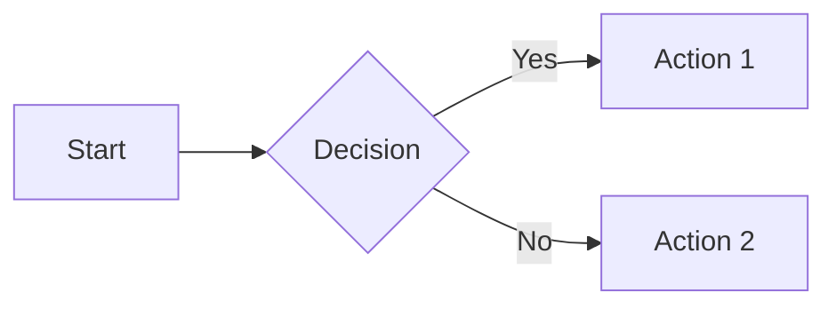

# Usage Guide

DocsForge is a drop-in replacement for MkDocs + Material. This guide covers daily usage, from creating a new site to deploying it.

## Quick Start

### Create a New Site
```bash
# Install DocsForge
pip install docsforge

# Create a new project
docsforge new my-docs
cd my-docs

# Build and serve
docsforge serve
```

### Build an Existing Site
```bash
cd your-project
# Edit docsforge.yml, then:
docsforge build
# Output goes to site/
```

## Commands

| Command | Description | Example |
|---------|-------------|---------|
| `docsforge new <path>` | Create a new project | `docsforge new docs/` |
| `docsforge build` | Build the site | `docsforge build` |
| `docsforge serve` | Build + serve locally | `docsforge serve` |
| `docsforge serve --dirty` | Incremental rebuild | `docsforge serve --dirty` |
| `docsforge --version` | Show version | `docsforge --version` |
| `docsforge --help` | Show help | `docsforge --help` |

## Configuration (`docsforge.yml`)

### Basic Config
```yaml
site_name: My Documentation
site_url: https://example.com/docs
site_description: A great docs site
site_author: Your Name

copyright: Copyright © 2025

nav:
  - Home: index.md
  - Getting Started: getting-started.md
  - Reference: reference.md

docs_dir: docs
site_dir: site
```

### Theme Customization
```yaml
theme:
  name: material
  logo: assets/logo.png
  favicon: assets/favicon.png
  
  palette:
    - media: "(prefers-color-scheme: light)"
      scheme: default
      primary: indigo
      accent: indigo
      toggle:
        icon: material/brightness-7
        name: Switch to dark mode
    - media: "(prefers-color-scheme: dark)"
      scheme: slate
      primary: indigo
      accent: indigo
      toggle:
        icon: material/brightness-4
        name: Switch to light mode
  
  features:
    - navigation.tabs
    - navigation.sections
    - navigation.expand
    - navigation.path
    - navigation.top
    - search.suggest
    - search.highlight
    - content.code.copy
    - content.code.annotate
    - content.action.edit
```

### Language & Search
```yaml
theme:
  language: en
  
  # Multi-language search pipeline
  search:
    language: en
    pipeline:
      - stemmer
      - stopWordFilter
      - trimmer
```

### Markdown Extensions
```yaml
markdown_extensions:
  - admonition
  - pymdownx.details
  - pymdownx.superfences:
      custom_fences:
        - name: mermaid
          class: mermaid
          format: !!python/name:pymdownx.superfences.fence_code_format
  - pymdownx.tabbed:
      alternate_style: true
  - pymdownx.tasklist:
      custom_checkbox: true
  - pymdownx.emoji:
      emoji_index: !!python/name:material.extensions.emoji.twemoji
      emoji_generator: !!python/name:material.extensions.emoji.to_svg
  - tables
  - toc:
      permalink: true
```

### Plugins
```yaml
plugins:
  - search
  - tags
  - blog:
      blog_dir: blog
      blog_toc: true
  - rss:
      match_path: blog/posts/.*
      date_from_meta:
        as_creation: date
      categories:
        - categories
        - tags
```

## Content Features

### Admonitions (Callouts)
```markdown
!!! note
    This is a note.

!!! warning "Be careful"
    This is a warning with a custom title.

!!! tip
    This is a tip.
    
    It can have multiple paragraphs.

!!! danger
    Don't do this!
```

### Code Blocks
```markdown
```python
print("hello")
```

```yaml
key: value
```
```

With annotations:
```markdown
```python
print("hello")  # (1)!
```

1.  :man_raising_hand: This is an annotation!
```

### Content Tabs
```markdown
=== "Python"

    ```python
    print("hello")
    ```

=== "JavaScript"

    ```javascript
    console.log("hello");
    ```
```

### Task Lists
```markdown
- [x] Completed task
- [ ] Incomplete task
- [ ] Another task
```

### Mermaid Diagrams
```markdown

```

### Math (KaTeX)
```markdown
Inline: $E = mc^2$

Block:
$$
\sum_{i=1}^{n} x_i = x_1 + x_2 + \cdots + x_n
$$
```

### Social Cards

DocsForge automatically generates social cards (Twitter/OG images) for every page. Enable in config:
```yaml
plugins:
  - social:
      cards: true
      cards_layout: default
```

### Tags
```markdown
---
tags:
  - tutorial
  - beginner
---

# My Page
```

## Git Integration

### Revision Dates
DocsForge automatically shows when each page was last updated, powered by git history:

```yaml
plugins:
  - git-revision-date-localized
```

This adds a "Last updated" line to each page footer.

### Edit Links
```yaml
edit_uri: edit/main/docs/
```

Adds an "Edit this page" button linking to your repo.

## PWA / Offline Support

DocsForge generates a Progressive Web App automatically. Features:
- **Offline access**: Service worker caches pages
- **Installable**: Add to home screen on mobile
- **Auto-update**: Checks for new content on each visit

No configuration needed — it's automatic!

## Search

Full-text search is built-in. Features:
- **Instant results**: Search as you type
- **Highlighting**: Matches highlighted in results
- **Suggestions**: Auto-complete suggestions
- **Multi-language**: Supports Chinese, English, and more

## Asset Handling

### Images
```markdown

```

Place images in `docs/assets/` (or your `docs_dir`).

### CSS & JS
```yaml
extra_css:
  - stylesheets/custom.css
extra_javascript:
  - javascripts/custom.js
```

Place files in `docs/stylesheets/` and `docs/javascripts/`.

## Performance Tips

### Incremental Builds (`--dirty`)
```bash
docsforge serve --dirty
```
Only rebuilds changed pages. Fast for large sites.

### Build Optimization
DocsForge automatically optimizes after each build:
- Removes unused icons and assets
- Strips source maps
- Removes old font formats (keeps only WOFF2)
- Gzips sitemap

No manual steps needed.

## Troubleshooting

| Issue | Solution |
|-------|----------|
| `ModuleNotFoundError` | `pip install docsforge` |
| Theme not found | DocsForge bundles Material — no extra install needed |
| Search not working | Ensure `search` plugin is in `plugins:` list |
| CSS not loading | Check path is relative to `docs_dir` |
| Build is slow | Use `--dirty` for incremental builds |
| Icons missing | Use `material/` prefix (e.g., `material/home`) |

## Next Steps

- [Publishing →](deployment-guide.md) — Deploy to GitHub Pages, Netlify, Vercel, and more
- [Migration Guide](migration.md) — Moving from MkDocs/Material
- [Changelog](../changelog/index.md) — What's new
