# Diagrams

DocsForge integrates [Mermaid.js](https://mermaid.js.org) for creating diagrams with text. No external tools or image editors needed — just write the diagram code in a fenced block.

---

## Configuration

Mermaid support is enabled by default:

``` yaml
markdown_extensions:
  - pymdownx.superfences:
      custom_fences:
        - name: mermaid
          class: mermaid
          format: !!python/name:pymdownx.superfences.fence_code_format
```

!!! note "Vendored"
    Mermaid is bundled with DocsForge. No CDN calls, no external dependencies.

---

## Flowchart

Show processes, decisions, and workflows:

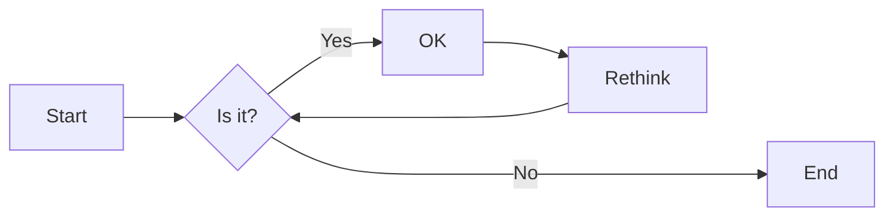

``` markdown

```

### Flowchart direction

| Direction | Syntax | Description |
|-----------|--------|-------------|
| Left-to-right | `graph LR` | Horizontal flow |
| Top-to-bottom | `graph TD` | Vertical flow |
| Right-to-left | `graph RL` | Reverse horizontal |
| Bottom-to-top | `graph BT` | Reverse vertical |

### Node shapes

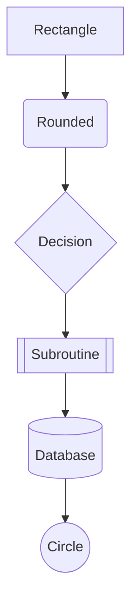

| Syntax | Shape |
|--------|-------|
| `A[text]` | Rectangle |
| `A(text)` | Rounded |
| `A{text}` | Diamond/Decision |
| `A[[text]]` | Subroutine |
| `A[(text)]` | Database |
| `A((text))` | Circle |
| `A>text]` | Asymmetric |
| `A{text}` | Rhombus |

---

## Sequence diagram

Show interactions between entities over time:

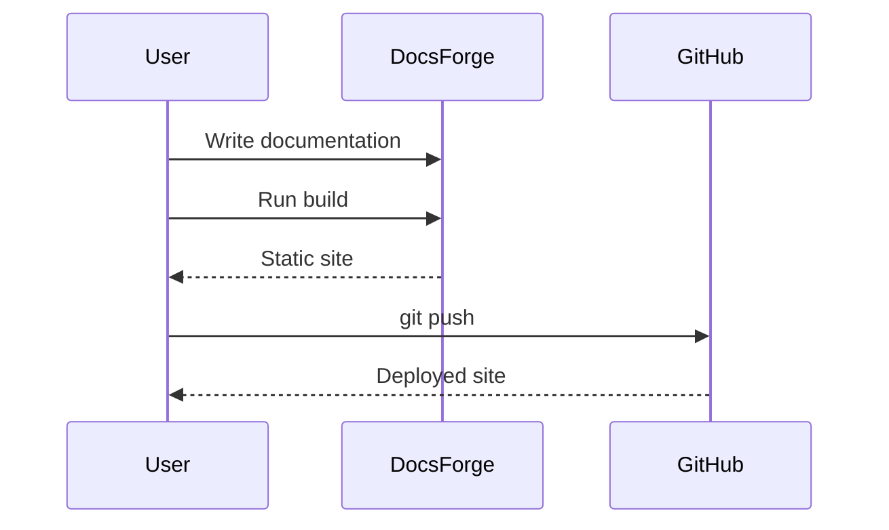

``` markdown

```

### Arrow types

| Syntax | Meaning |
|--------|---------|
| `->` | Solid line |
| `-->` | Dotted line |
| `->>` | Solid arrow |
| `-->>` | Dotted arrow |
| `-x` | Solid cross |
| `--x` | Dotted cross |

---

## Class diagram

Show object-oriented structure:

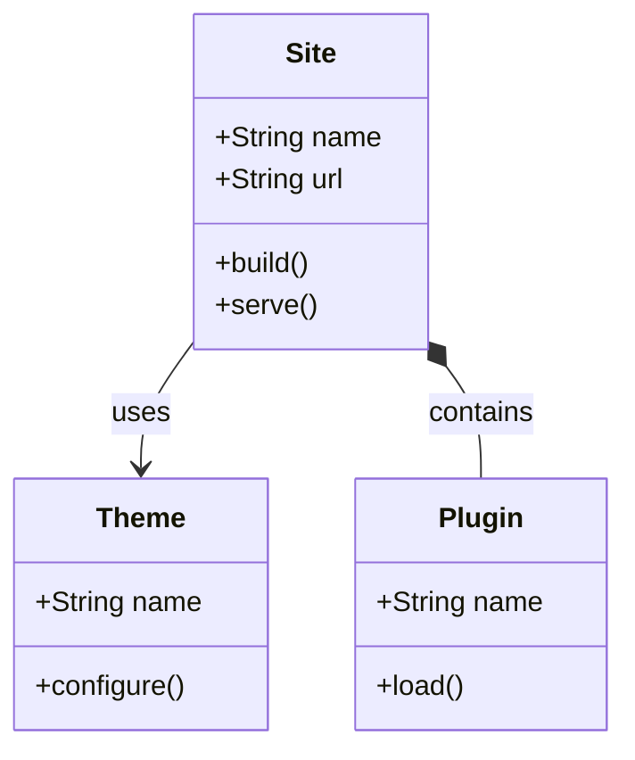

### Relationship types

| Syntax | Meaning |
|--------|---------|
| `-->` | Association |
| `*--` | Composition |
| `o--` | Aggregation |
| `--|>` | Inheritance |
| `..>` | Dependency |
| `--` | Link |

---

## State diagram

Show state machines and transitions:

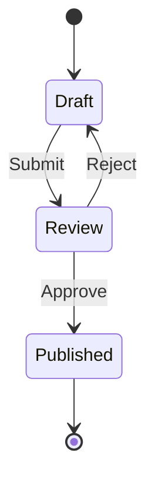

``` markdown

```

---

## Gantt chart

Show project timelines:

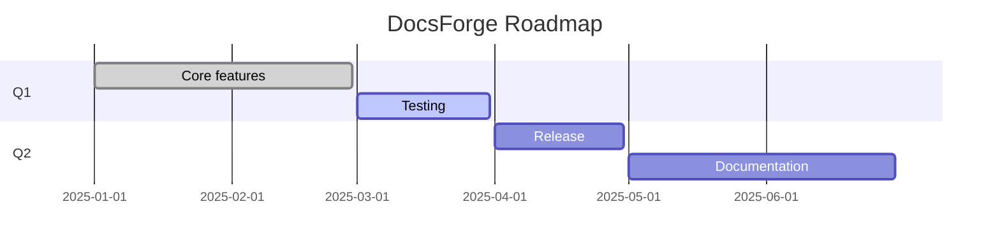

``` markdown

```

### Status indicators

| Status | Syntax | Color |
|--------|--------|-------|
| Done | `:done,` | Green |
| Active | `:active,` | Blue |
| Critical | `:crit,` | Red |
| Default | `:,` | Gray |

---

## Pie chart

Show proportional data:

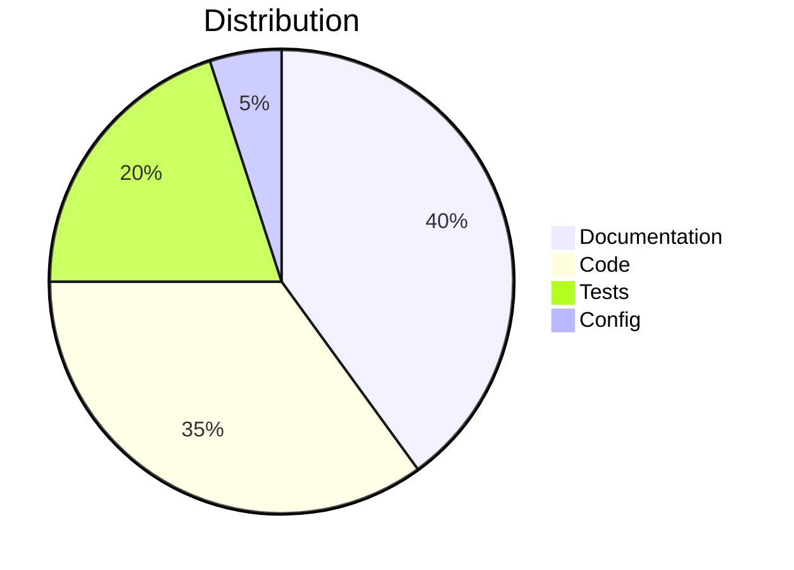

---

## Git graph

Show Git branch history:

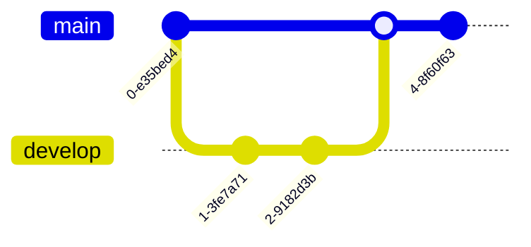

---

## Mindmap

Show hierarchical concepts:

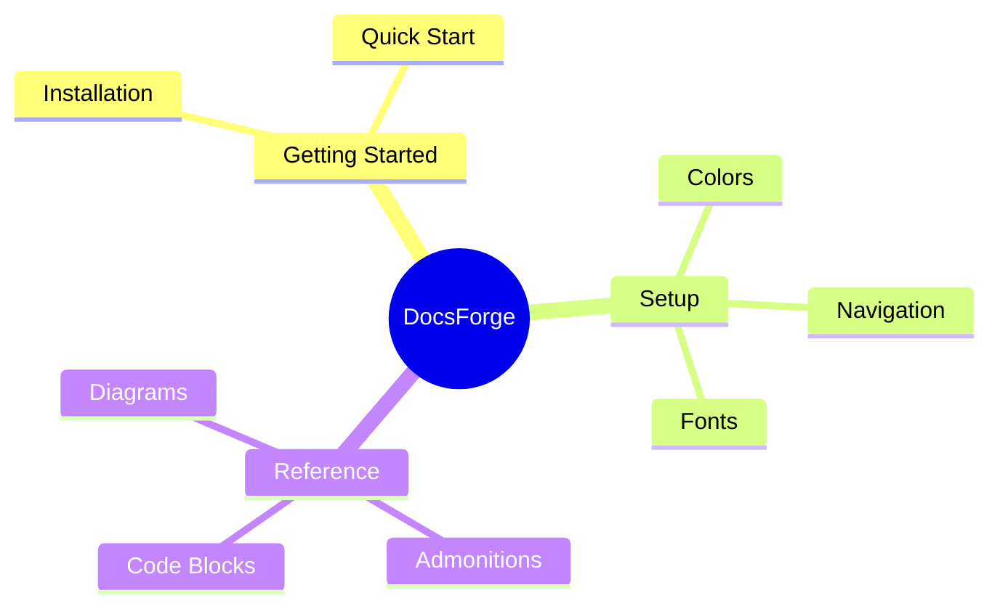

---

## Entity relationship diagram

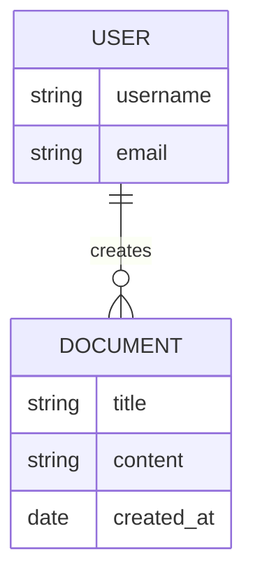

---

## User journey

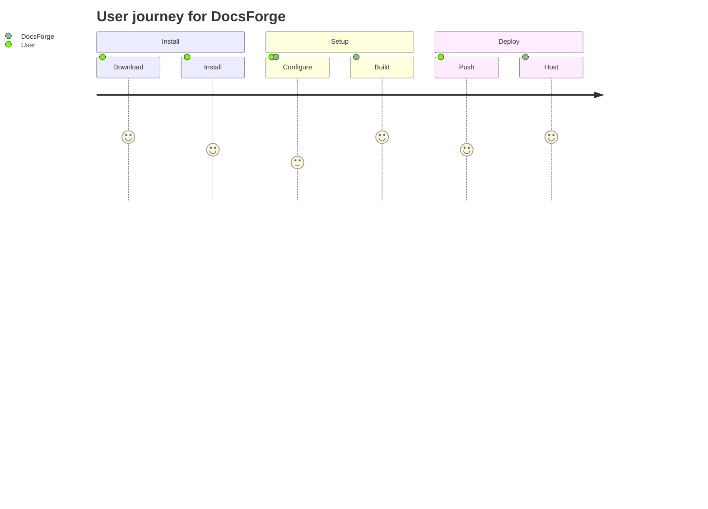

---

## C4 diagram (architecture)

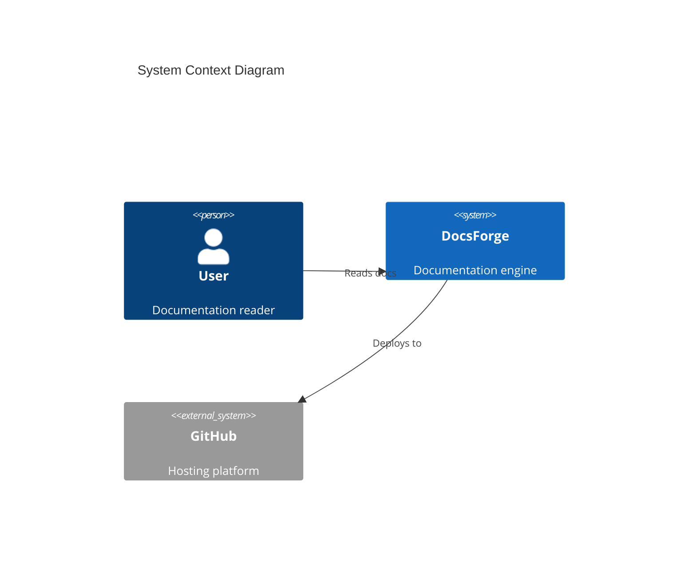

---

## Best practices

- Keep diagrams simple — 5-10 nodes maximum for readability
- Use consistent direction within a page (all LR or all TD)
- Add labels to arrows (`-->|label|`)
- Use colors sparingly
- Test diagrams in both light and dark themes
- Avoid diagrams wider than the content area
- Add a text description below complex diagrams for accessibility

---

## Troubleshooting

### Diagram not rendering

1. Check Mermaid syntax is valid (use [Mermaid Live Editor](https://mermaid.live))
2. Ensure ` ```mermaid ` fence is used (not ` ``` `)
3. Complex diagrams may need `mermaid` extension explicitly enabled

### Text too small

Break large diagrams into smaller sub-diagrams. Consider using `subgraph`:

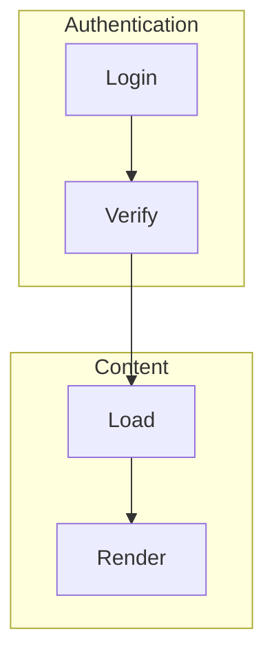

---

## Next steps

- [Data tables](data-tables.md)
- [Formatting](formatting.md)
- [Code blocks](code-blocks.md)
